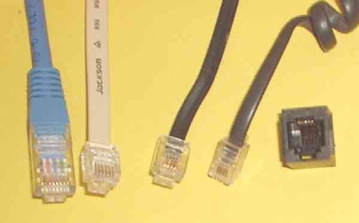
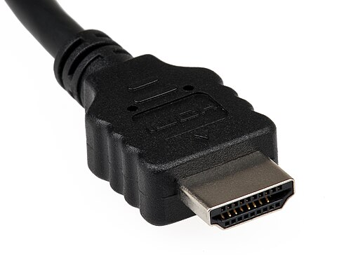
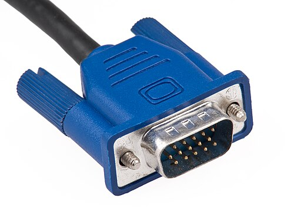
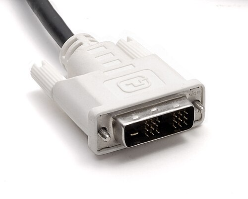
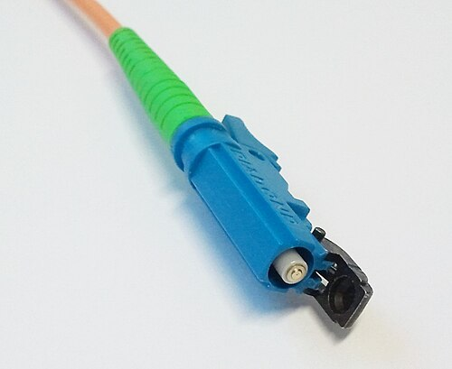
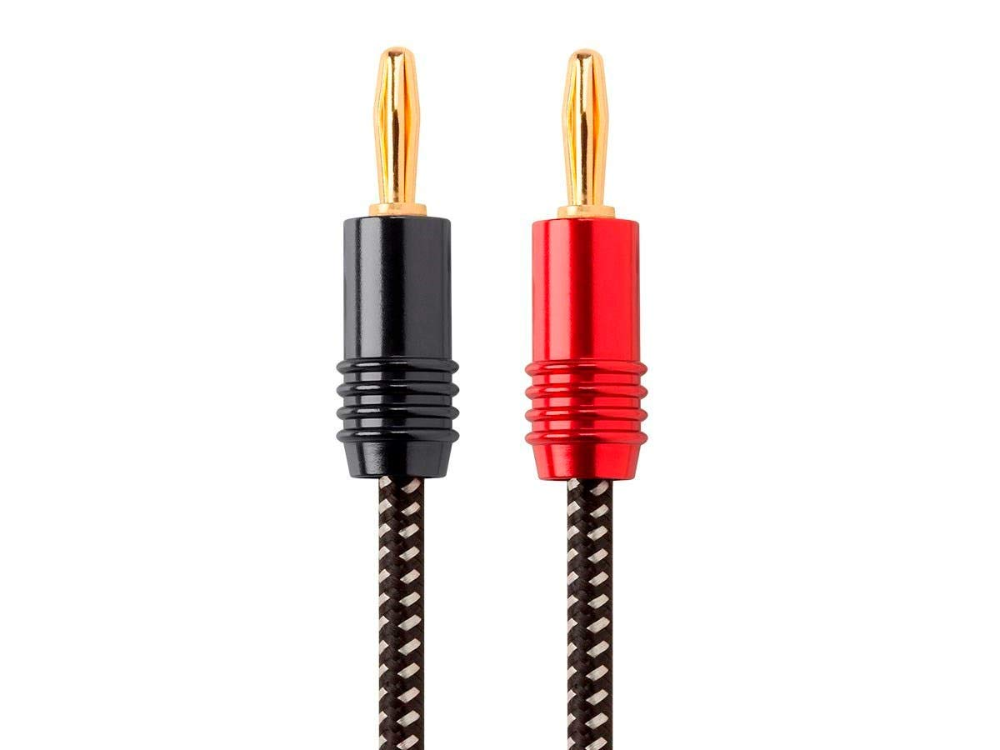

Table to help with recognition of various types of cables for connecting to peripheral components.

### In progress...

- Identify the cable or connector.
- Identify primary use (data transfer, video output, networking, etc.).
- Note key features (shape, size, number of pins, color coding, etc.).
- Identifying characteristics.

| Cable Type/Family    | Image              | Primary Use | Key Features | Identifying Characteristics |
=================================================================================
| Ethernet               |  | Evolved from telephone twisted-pair cables and primarily used in network connections | fast and universal with support for fair distances | plastic tab on square/rectangular housing with six pins/wires |
| HDMI                   |  | Digital audio and video | Fast parallel connectivity | Near-rectangular end like two matching lopsided letter Ms facing one another |
| USB (All standards)    | [USB connections](../images/posts/cables/USB_A,_B,_C_(1.1-3.0)_connectors.svg) | Power and data over moderate immediate distances | | |
| VGA                    | | Legacy analog audio and video transfer | Relative universality for a long time | Plastic handled attachment screws |
| DVI (All standards)    |  | | | |
| Fiber Optic Connectors | | Long distances with very little loss | | |
| Surround Sound         | | | | |

All images are from Wikipedia.
