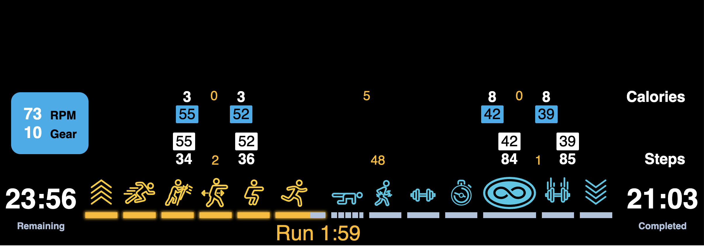

  <section id="hero">
    <h1>Let's Communicate</h1>
    <svg  id=whatsthestory viewBox="0 0 713 87">
    <title>What's the story?</title>
    <g transform="matrix(1,0,0,1,-69.2692,-21.454)">
        <g transform="matrix(1,0,0,1,-7.358,-70.083)">
            <path d="M167.971,93.457L146.611,160.945L144.259,160.945L122.851,98.641C122.627,98.001 122.451,97.361 122.323,96.721C122.195,97.361 122.019,98.001 121.795,98.641L100.291,160.945L97.987,160.945L76.627,93.457L78.787,93.457C79.331,93.457 79.683,93.729 79.843,94.273L98.467,154.225C98.787,155.313 99.059,156.465 99.283,157.681C99.411,157.041 99.547,156.433 99.691,155.857C99.835,155.281 99.987,154.737 100.147,154.225L120.931,94.273C121.091,93.729 121.475,93.457 122.083,93.457L122.707,93.457C123.251,93.457 123.603,93.729 123.763,94.273L144.547,154.225C144.867,155.217 145.155,156.353 145.411,157.633C145.539,156.993 145.667,156.393 145.795,155.833C145.923,155.273 146.067,154.737 146.227,154.225L164.851,94.273C165.011,93.729 165.395,93.457 166.003,93.457L167.971,93.457Z" style="fill-rule:nonzero;"/>
            <path d="M181.555,122.641C183.763,119.665 186.387,117.289 189.427,115.513C192.467,113.737 195.779,112.849 199.363,112.849C201.987,112.849 204.283,113.257 206.251,114.073C208.219,114.889 209.851,116.057 211.147,117.577C212.443,119.097 213.419,120.961 214.075,123.169C214.731,125.377 215.059,127.873 215.059,130.657L215.059,160.945L212.515,160.945L212.515,130.657C212.515,128.193 212.243,125.985 211.699,124.033C211.155,122.081 210.315,120.425 209.179,119.065C208.043,117.705 206.627,116.665 204.931,115.945C203.235,115.225 201.235,114.865 198.931,114.865C195.475,114.865 192.283,115.769 189.355,117.577C186.427,119.385 183.827,121.889 181.555,125.089L181.555,160.945L179.011,160.945L179.011,91.537L181.555,91.537L181.555,122.641Z" style="fill-rule:nonzero;"/>
            <path d="M258.355,137.233C248.691,137.553 241.547,138.753 236.923,140.833C232.299,142.913 229.987,145.841 229.987,149.617C229.987,151.377 230.283,152.897 230.875,154.177C231.467,155.457 232.251,156.521 233.227,157.369C234.203,158.217 235.315,158.841 236.563,159.241C237.811,159.641 239.091,159.841 240.403,159.841C242.451,159.841 244.323,159.609 246.019,159.145C247.715,158.681 249.283,158.049 250.723,157.249C252.163,156.449 253.507,155.505 254.755,154.417C256.003,153.329 257.203,152.177 258.355,150.961L258.355,137.233ZM230.035,120.337C232.403,117.905 234.883,116.049 237.475,114.769C240.067,113.489 243.027,112.849 246.355,112.849C248.819,112.849 250.963,113.241 252.787,114.025C254.611,114.809 256.123,115.937 257.323,117.409C258.523,118.881 259.411,120.665 259.987,122.761C260.563,124.857 260.851,127.217 260.851,129.841L260.851,160.945L259.987,160.945C259.347,160.945 258.979,160.609 258.883,159.937L258.403,152.929C257.091,154.273 255.779,155.489 254.467,156.577C253.155,157.665 251.763,158.585 250.291,159.337C248.819,160.089 247.235,160.673 245.539,161.089C243.843,161.505 241.971,161.713 239.923,161.713C238.419,161.713 236.931,161.489 235.459,161.041C233.987,160.593 232.659,159.889 231.475,158.929C230.291,157.969 229.339,156.729 228.619,155.209C227.899,153.689 227.539,151.857 227.539,149.713C227.539,147.633 228.139,145.745 229.339,144.049C230.539,142.353 232.403,140.889 234.931,139.657C237.459,138.425 240.659,137.449 244.531,136.729C248.403,136.009 253.011,135.585 258.355,135.457L258.355,129.841C258.355,125.105 257.331,121.425 255.283,118.801C253.235,116.177 250.195,114.865 246.163,114.865C243.763,114.865 241.699,115.209 239.971,115.897C238.243,116.585 236.803,117.353 235.651,118.201C234.499,119.049 233.579,119.817 232.891,120.505C232.203,121.193 231.683,121.537 231.331,121.537C231.011,121.537 230.723,121.361 230.467,121.009L230.035,120.337Z" style="fill-rule:nonzero;"/>
            <path d="M288.883,161.713C285.939,161.713 283.635,160.905 281.971,159.289C280.307,157.673 279.475,155.073 279.475,151.489L279.475,117.361L272.083,117.361C271.475,117.361 271.171,117.121 271.171,116.641L271.171,115.777L279.475,115.441L280.195,97.201C280.227,97.009 280.307,96.825 280.435,96.649C280.563,96.473 280.739,96.385 280.963,96.385L282.019,96.385L282.019,115.441L297.667,115.441L297.667,117.361L282.019,117.361L282.019,151.393C282.019,152.865 282.211,154.121 282.595,155.161C282.979,156.201 283.491,157.057 284.131,157.729C284.771,158.401 285.531,158.889 286.411,159.193C287.291,159.497 288.243,159.649 289.267,159.649C290.515,159.649 291.611,159.457 292.555,159.073C293.499,158.689 294.307,158.273 294.979,157.825C295.651,157.377 296.195,156.961 296.611,156.577C297.027,156.193 297.331,156.001 297.523,156.001C297.683,156.001 297.859,156.097 298.051,156.289L298.675,157.201C298.131,157.873 297.499,158.481 296.779,159.025C296.059,159.569 295.267,160.041 294.403,160.441C293.539,160.841 292.643,161.153 291.715,161.377C290.787,161.601 289.843,161.713 288.883,161.713Z" style="fill-rule:nonzero;"/>
            <path d="M310.675,93.457L310.675,107.521L310.435,114.865C310.371,115.473 310.083,115.777 309.571,115.777C309.059,115.777 308.771,115.473 308.707,114.865L308.515,107.521L308.515,93.457L310.675,93.457Z" style="fill-rule:nonzero;"/>
            <path d="M352.195,118.465C352.035,118.753 351.795,118.897 351.475,118.897C351.187,118.897 350.779,118.681 350.251,118.249C349.723,117.817 348.995,117.353 348.067,116.857C347.139,116.361 345.979,115.897 344.587,115.465C343.195,115.033 341.475,114.817 339.427,114.817C337.539,114.817 335.819,115.097 334.267,115.657C332.715,116.217 331.379,116.961 330.259,117.889C329.139,118.817 328.275,119.905 327.667,121.153C327.059,122.401 326.755,123.697 326.755,125.041C326.755,126.641 327.147,127.985 327.931,129.073C328.715,130.161 329.747,131.081 331.027,131.833C332.307,132.585 333.763,133.225 335.395,133.753C337.027,134.281 338.691,134.809 340.387,135.337C342.083,135.865 343.747,136.433 345.379,137.041C347.011,137.649 348.467,138.401 349.747,139.297C351.027,140.193 352.059,141.297 352.843,142.609C353.627,143.921 354.019,145.537 354.019,147.457C354.019,149.441 353.667,151.297 352.963,153.025C352.259,154.753 351.227,156.265 349.867,157.561C348.507,158.857 346.843,159.873 344.875,160.609C342.907,161.345 340.659,161.713 338.131,161.713C336.435,161.713 334.899,161.577 333.523,161.305C332.147,161.033 330.867,160.649 329.683,160.153C328.499,159.657 327.395,159.057 326.371,158.353C325.347,157.649 324.355,156.865 323.395,156.001L324.019,155.185C324.147,155.025 324.267,154.905 324.379,154.825C324.491,154.745 324.675,154.705 324.931,154.705C325.251,154.705 325.707,154.969 326.299,155.497C326.891,156.025 327.691,156.609 328.699,157.249C329.707,157.889 330.979,158.473 332.515,159.001C334.051,159.529 335.939,159.793 338.179,159.793C340.387,159.793 342.331,159.481 344.011,158.857C345.691,158.233 347.099,157.377 348.235,156.289C349.371,155.201 350.227,153.929 350.803,152.473C351.379,151.017 351.667,149.473 351.667,147.841C351.667,146.113 351.275,144.673 350.491,143.521C349.707,142.369 348.675,141.401 347.395,140.617C346.115,139.833 344.659,139.169 343.027,138.625C341.395,138.081 339.731,137.553 338.035,137.041C336.339,136.529 334.675,135.977 333.043,135.385C331.411,134.793 329.955,134.057 328.675,133.177C327.395,132.297 326.363,131.217 325.579,129.937C324.795,128.657 324.403,127.057 324.403,125.137C324.403,123.537 324.763,121.993 325.483,120.505C326.203,119.017 327.219,117.705 328.531,116.569C329.843,115.433 331.419,114.529 333.259,113.857C335.099,113.185 337.155,112.849 339.427,112.849C342.179,112.849 344.611,113.233 346.723,114.001C348.835,114.769 350.835,115.985 352.723,117.649L352.195,118.465Z" style="fill-rule:nonzero;"/>
            <path d="M406.387,161.713C403.443,161.713 401.139,160.905 399.475,159.289C397.811,157.673 396.979,155.073 396.979,151.489L396.979,117.361L389.587,117.361C388.979,117.361 388.675,117.121 388.675,116.641L388.675,115.777L396.979,115.441L397.699,97.201C397.731,97.009 397.811,96.825 397.939,96.649C398.067,96.473 398.243,96.385 398.467,96.385L399.523,96.385L399.523,115.441L415.171,115.441L415.171,117.361L399.523,117.361L399.523,151.393C399.523,152.865 399.715,154.121 400.099,155.161C400.483,156.201 400.995,157.057 401.635,157.729C402.275,158.401 403.035,158.889 403.915,159.193C404.795,159.497 405.747,159.649 406.771,159.649C408.019,159.649 409.115,159.457 410.059,159.073C411.003,158.689 411.811,158.273 412.483,157.825C413.155,157.377 413.699,156.961 414.115,156.577C414.531,156.193 414.835,156.001 415.027,156.001C415.187,156.001 415.363,156.097 415.555,156.289L416.179,157.201C415.635,157.873 415.003,158.481 414.283,159.025C413.563,159.569 412.771,160.041 411.907,160.441C411.043,160.841 410.147,161.153 409.219,161.377C408.291,161.601 407.347,161.713 406.387,161.713Z" style="fill-rule:nonzero;"/>
            <path d="M428.899,122.641C431.107,119.665 433.731,117.289 436.771,115.513C439.811,113.737 443.123,112.849 446.707,112.849C449.331,112.849 451.627,113.257 453.595,114.073C455.563,114.889 457.195,116.057 458.491,117.577C459.787,119.097 460.763,120.961 461.419,123.169C462.075,125.377 462.403,127.873 462.403,130.657L462.403,160.945L459.859,160.945L459.859,130.657C459.859,128.193 459.587,125.985 459.043,124.033C458.499,122.081 457.659,120.425 456.523,119.065C455.387,117.705 453.971,116.665 452.275,115.945C450.579,115.225 448.579,114.865 446.275,114.865C442.819,114.865 439.627,115.769 436.699,117.577C433.771,119.385 431.171,121.889 428.899,125.089L428.899,160.945L426.355,160.945L426.355,91.537L428.899,91.537L428.899,122.641Z" style="fill-rule:nonzero;"/>
            <path d="M512.803,132.721C512.803,129.873 512.395,127.337 511.579,125.113C510.763,122.889 509.643,121.009 508.219,119.473C506.795,117.937 505.107,116.769 503.155,115.969C501.203,115.169 499.091,114.769 496.819,114.769C494.131,114.769 491.723,115.193 489.595,116.041C487.467,116.889 485.635,118.097 484.099,119.665C482.563,121.233 481.323,123.121 480.379,125.329C479.435,127.537 478.819,130.001 478.531,132.721L512.803,132.721ZM513.859,155.137C513.219,155.937 512.323,156.721 511.171,157.489C510.019,158.257 508.699,158.937 507.211,159.529C505.723,160.121 504.107,160.601 502.363,160.969C500.619,161.337 498.835,161.521 497.011,161.521C493.779,161.521 490.859,160.953 488.251,159.817C485.643,158.681 483.419,157.041 481.579,154.897C479.739,152.753 478.323,150.121 477.331,147.001C476.339,143.881 475.843,140.321 475.843,136.321C475.843,132.865 476.315,129.705 477.259,126.841C478.203,123.977 479.571,121.505 481.363,119.425C483.155,117.345 485.347,115.729 487.939,114.577C490.531,113.425 493.475,112.849 496.771,112.849C499.331,112.849 501.723,113.297 503.947,114.193C506.171,115.089 508.115,116.409 509.779,118.153C511.443,119.897 512.747,122.049 513.691,124.609C514.635,127.169 515.107,130.097 515.107,133.393C515.107,134.065 514.819,134.401 514.243,134.401L478.387,134.401C478.355,134.721 478.339,135.033 478.339,135.337L478.339,136.321C478.339,140.097 478.787,143.425 479.683,146.305C480.579,149.185 481.843,151.601 483.475,153.553C485.107,155.505 487.083,156.985 489.403,157.993C491.723,159.001 494.307,159.505 497.155,159.505C499.683,159.505 501.875,159.225 503.731,158.665C505.587,158.105 507.139,157.489 508.387,156.817C509.635,156.145 510.603,155.529 511.291,154.969C511.979,154.409 512.419,154.129 512.611,154.129C512.867,154.129 513.075,154.225 513.235,154.417L513.859,155.137Z" style="fill-rule:nonzero;"/>
            <path d="M580.483,118.465C580.323,118.753 580.083,118.897 579.763,118.897C579.475,118.897 579.067,118.681 578.539,118.249C578.011,117.817 577.283,117.353 576.355,116.857C575.427,116.361 574.267,115.897 572.875,115.465C571.483,115.033 569.763,114.817 567.715,114.817C565.827,114.817 564.107,115.097 562.555,115.657C561.003,116.217 559.667,116.961 558.547,117.889C557.427,118.817 556.563,119.905 555.955,121.153C555.347,122.401 555.043,123.697 555.043,125.041C555.043,126.641 555.435,127.985 556.219,129.073C557.003,130.161 558.035,131.081 559.315,131.833C560.595,132.585 562.051,133.225 563.683,133.753C565.315,134.281 566.979,134.809 568.675,135.337C570.371,135.865 572.035,136.433 573.667,137.041C575.299,137.649 576.755,138.401 578.035,139.297C579.315,140.193 580.347,141.297 581.131,142.609C581.915,143.921 582.307,145.537 582.307,147.457C582.307,149.441 581.955,151.297 581.251,153.025C580.547,154.753 579.515,156.265 578.155,157.561C576.795,158.857 575.131,159.873 573.163,160.609C571.195,161.345 568.947,161.713 566.419,161.713C564.723,161.713 563.187,161.577 561.811,161.305C560.435,161.033 559.155,160.649 557.971,160.153C556.787,159.657 555.683,159.057 554.659,158.353C553.635,157.649 552.643,156.865 551.683,156.001L552.307,155.185C552.435,155.025 552.555,154.905 552.667,154.825C552.779,154.745 552.963,154.705 553.219,154.705C553.539,154.705 553.995,154.969 554.587,155.497C555.179,156.025 555.979,156.609 556.987,157.249C557.995,157.889 559.267,158.473 560.803,159.001C562.339,159.529 564.227,159.793 566.467,159.793C568.675,159.793 570.619,159.481 572.299,158.857C573.979,158.233 575.387,157.377 576.523,156.289C577.659,155.201 578.515,153.929 579.091,152.473C579.667,151.017 579.955,149.473 579.955,147.841C579.955,146.113 579.563,144.673 578.779,143.521C577.995,142.369 576.963,141.401 575.683,140.617C574.403,139.833 572.947,139.169 571.315,138.625C569.683,138.081 568.019,137.553 566.323,137.041C564.627,136.529 562.963,135.977 561.331,135.385C559.699,134.793 558.243,134.057 556.963,133.177C555.683,132.297 554.651,131.217 553.867,129.937C553.083,128.657 552.691,127.057 552.691,125.137C552.691,123.537 553.051,121.993 553.771,120.505C554.491,119.017 555.507,117.705 556.819,116.569C558.131,115.433 559.707,114.529 561.547,113.857C563.387,113.185 565.443,112.849 567.715,112.849C570.467,112.849 572.899,113.233 575.011,114.001C577.123,114.769 579.123,115.985 581.011,117.649L580.483,118.465Z" style="fill-rule:nonzero;"/>
            <path d="M607.843,161.713C604.899,161.713 602.595,160.905 600.931,159.289C599.267,157.673 598.435,155.073 598.435,151.489L598.435,117.361L591.043,117.361C590.435,117.361 590.131,117.121 590.131,116.641L590.131,115.777L598.435,115.441L599.155,97.201C599.187,97.009 599.267,96.825 599.395,96.649C599.523,96.473 599.699,96.385 599.923,96.385L600.979,96.385L600.979,115.441L616.627,115.441L616.627,117.361L600.979,117.361L600.979,151.393C600.979,152.865 601.171,154.121 601.555,155.161C601.939,156.201 602.451,157.057 603.091,157.729C603.731,158.401 604.491,158.889 605.371,159.193C606.251,159.497 607.203,159.649 608.227,159.649C609.475,159.649 610.571,159.457 611.515,159.073C612.459,158.689 613.267,158.273 613.939,157.825C614.611,157.377 615.155,156.961 615.571,156.577C615.987,156.193 616.291,156.001 616.483,156.001C616.643,156.001 616.819,156.097 617.011,156.289L617.635,157.201C617.091,157.873 616.459,158.481 615.739,159.025C615.019,159.569 614.227,160.041 613.363,160.441C612.499,160.841 611.603,161.153 610.675,161.377C609.747,161.601 608.803,161.713 607.843,161.713Z" style="fill-rule:nonzero;"/>
            <path d="M645.859,112.849C649.219,112.849 652.203,113.433 654.811,114.601C657.419,115.769 659.619,117.417 661.411,119.545C663.203,121.673 664.563,124.241 665.491,127.249C666.419,130.257 666.883,133.601 666.883,137.281C666.883,140.961 666.419,144.297 665.491,147.289C664.563,150.281 663.203,152.833 661.411,154.945C659.619,157.057 657.419,158.681 654.811,159.817C652.203,160.953 649.219,161.521 645.859,161.521C642.499,161.521 639.515,160.953 636.907,159.817C634.299,158.681 632.099,157.057 630.307,154.945C628.515,152.833 627.155,150.281 626.227,147.289C625.299,144.297 624.835,140.961 624.835,137.281C624.835,133.601 625.299,130.257 626.227,127.249C627.155,124.241 628.515,121.673 630.307,119.545C632.099,117.417 634.299,115.769 636.907,114.601C639.515,113.433 642.499,112.849 645.859,112.849ZM645.859,159.505C648.931,159.505 651.619,158.977 653.923,157.921C656.227,156.865 658.155,155.361 659.707,153.409C661.259,151.457 662.419,149.121 663.187,146.401C663.955,143.681 664.339,140.641 664.339,137.281C664.339,133.921 663.955,130.865 663.187,128.113C662.419,125.361 661.259,123.001 659.707,121.033C658.155,119.065 656.227,117.545 653.923,116.473C651.619,115.401 648.931,114.865 645.859,114.865C642.787,114.865 640.099,115.401 637.795,116.473C635.491,117.545 633.563,119.065 632.011,121.033C630.459,123.001 629.299,125.361 628.531,128.113C627.763,130.865 627.379,133.921 627.379,137.281C627.379,140.641 627.763,143.681 628.531,146.401C629.299,149.121 630.459,151.457 632.011,153.409C633.563,155.361 635.491,156.865 637.795,157.921C640.099,158.977 642.787,159.505 645.859,159.505Z" style="fill-rule:nonzero;"/>
            <path d="M683.347,126.289C684.051,124.145 684.883,122.241 685.843,120.577C686.803,118.913 687.915,117.505 689.179,116.353C690.443,115.201 691.875,114.329 693.475,113.737C695.075,113.145 696.883,112.849 698.899,112.849C699.827,112.849 700.779,112.921 701.755,113.065C702.731,113.209 703.603,113.505 704.371,113.953L704.083,115.441C703.955,115.793 703.731,115.969 703.411,115.969C703.059,115.969 702.523,115.849 701.803,115.609C701.083,115.369 700.019,115.249 698.611,115.249C696.627,115.249 694.859,115.561 693.307,116.185C691.755,116.809 690.379,117.729 689.179,118.945C687.979,120.161 686.915,121.681 685.987,123.505C685.059,125.329 684.211,127.457 683.443,129.889L683.443,160.945L680.899,160.945L680.899,113.617L682.051,113.617C682.691,113.617 683.027,113.969 683.059,114.673L683.347,126.289Z" style="fill-rule:nonzero;"/>
            <path d="M751.075,113.617L723.475,176.833C723.315,177.153 723.123,177.441 722.899,177.697C722.675,177.953 722.355,178.081 721.939,178.081L720.259,178.081L728.419,159.793L708.163,113.617L710.083,113.617C710.435,113.617 710.715,113.713 710.923,113.905C711.131,114.097 711.267,114.289 711.331,114.481L728.995,154.993C729.315,155.697 729.555,156.433 729.715,157.201C729.939,156.529 730.211,155.793 730.531,154.993L748.099,114.481C748.227,114.225 748.395,114.017 748.603,113.857C748.811,113.697 749.043,113.617 749.299,113.617L751.075,113.617Z" style="fill-rule:nonzero;"/>
            <path d="M758.131,99.265C758.931,98.433 759.835,97.625 760.843,96.841C761.851,96.057 762.979,95.353 764.227,94.729C765.475,94.105 766.835,93.609 768.307,93.241C769.779,92.873 771.379,92.689 773.107,92.689C775.187,92.689 777.179,93.009 779.083,93.649C780.987,94.289 782.667,95.209 784.123,96.409C785.579,97.609 786.739,99.073 787.603,100.801C788.467,102.529 788.899,104.481 788.899,106.657C788.899,108.481 788.675,110.113 788.227,111.553C787.779,112.993 787.187,114.289 786.451,115.441C785.715,116.593 784.875,117.633 783.931,118.561C782.987,119.489 782.019,120.345 781.027,121.129C780.035,121.913 779.059,122.641 778.099,123.313C777.139,123.985 776.275,124.665 775.507,125.353C774.739,126.041 774.115,126.737 773.635,127.441C773.155,128.145 772.899,128.929 772.867,129.793L772.483,137.905L770.803,137.905L770.659,129.601C770.627,128.321 770.995,127.185 771.763,126.193C772.531,125.201 773.507,124.241 774.691,123.313C775.875,122.385 777.147,121.425 778.507,120.433C779.867,119.441 781.139,118.313 782.323,117.049C783.507,115.785 784.491,114.321 785.275,112.657C786.059,110.993 786.451,109.025 786.451,106.753C786.451,104.865 786.075,103.177 785.323,101.689C784.571,100.201 783.571,98.945 782.323,97.921C781.075,96.897 779.643,96.113 778.027,95.569C776.411,95.025 774.723,94.753 772.963,94.753C770.755,94.753 768.843,95.057 767.227,95.665C765.611,96.273 764.251,96.945 763.147,97.681C762.043,98.417 761.187,99.089 760.579,99.697C759.971,100.305 759.587,100.609 759.427,100.609C759.139,100.609 758.915,100.497 758.755,100.273L758.131,99.265ZM768.019,158.113C768.019,157.089 768.363,156.217 769.051,155.497C769.739,154.777 770.595,154.417 771.619,154.417C772.643,154.417 773.515,154.777 774.235,155.497C774.955,156.217 775.315,157.089 775.315,158.113C775.315,159.137 774.955,159.993 774.235,160.681C773.515,161.369 772.643,161.713 771.619,161.713C770.595,161.713 769.739,161.369 769.051,160.681C768.363,159.993 768.019,159.137 768.019,158.113Z" style="fill-rule:nonzero;"/>
        </g>
    </g>
</svg>

    <svg id=whoneedstohearit viewBox="0 0 837 70">

      <title>Who needs to hear it?</title>
      <desc></desc>
      <g transform="matrix(1,0,0,1,-66.487,-111.159)">
        <g transform="matrix(1,0,0,1,-9.5642,18.3743)">
            <path d="M163.603,95.665L144.691,151.441C144.076,153.375 143.46,155.149 142.844,157.131C142.243,155.313 141.634,153.435 140.947,151.633L121.267,99.313L120.307,99.313L100.339,152.593C99.856,153.961 99.306,155.531 98.801,156.907C98.298,155.555 97.749,154.054 97.267,152.689L77.971,95.665L76.051,95.665L76.051,95.857L98.227,161.425L98.995,161.425L119.539,106.801C119.925,105.72 120.373,104.639 120.784,103.457C121.172,104.617 121.572,105.664 122.035,106.897L142.579,161.425L143.347,161.425L165.523,95.857L165.523,95.665L163.603,95.665Z" style="fill-rule:nonzero;"/>
            <path d="M193.747,121.873C185.195,121.873 179.863,127.577 178.291,133.312L178.291,92.785L176.371,92.785L176.371,160.945L178.291,160.945L178.291,141.745C178.291,130.897 185.011,123.697 193.459,123.697C202.387,123.697 205.555,129.457 205.555,137.425L205.555,160.945L207.475,160.945L207.475,137.425C207.475,128.401 203.251,121.873 193.747,121.873L193.747,121.873Z" style="fill-rule:nonzero;"/>
            <path d="M240.307,161.809C251.731,161.809 259.891,153.457 259.891,141.745C259.891,129.937 251.731,121.585 240.307,121.585C228.883,121.585 220.723,129.937 220.723,141.745C220.723,153.457 228.883,161.809 240.307,161.809ZM240.307,159.985C230.035,159.985 222.643,152.401 222.643,141.745C222.643,130.993 230.035,123.409 240.307,123.409C250.579,123.409 257.971,130.993 257.971,141.745C257.971,152.401 250.579,159.985 240.307,159.985Z" style="fill-rule:nonzero;"/>
            <path d="M312.307,121.873C303.625,121.873 298.115,126.964 296.553,130.92L296.467,122.545L294.643,122.545L294.643,160.945L296.563,160.945L296.563,138.193C296.563,128.785 304.147,123.697 312.211,123.697C321.523,123.697 323.827,129.553 323.827,137.617L323.827,160.945L325.747,160.945L325.747,137.425C325.747,128.497 322.387,121.873 312.307,121.873Z" style="fill-rule:nonzero;"/>
            <path d="M358.099,121.585C346.003,121.585 338.995,131.185 338.995,141.745C338.995,152.977 346.579,161.905 358.291,161.905C365.203,161.905 369.619,159.697 373.459,156.241L372.403,154.801C368.755,158.161 365.107,160.081 358.291,160.081C349.156,160.081 341.379,153.474 340.935,142.897L375.571,142.897C375.642,142.043 375.678,141.198 375.678,140.365C375.678,129.978 370.097,121.585 358.099,121.585L358.099,121.585ZM358.099,123.409C369.087,123.409 374.103,131.035 373.777,141.073L340.931,141.073C341.319,130.597 348.754,123.409 358.099,123.409L358.099,123.409Z" style="fill-rule:nonzero;"/>
            <path d="M404.083,121.585C391.987,121.585 384.979,131.185 384.979,141.745C384.979,152.977 392.563,161.905 404.275,161.905C411.187,161.905 415.603,159.697 419.443,156.241L418.387,154.801C414.739,158.161 411.091,160.081 404.275,160.081C395.14,160.081 387.363,153.474 386.919,142.897L421.555,142.897C421.626,142.043 421.662,141.198 421.662,140.365C421.662,129.978 416.081,121.585 404.083,121.585L404.083,121.585ZM404.083,123.409C415.071,123.409 420.087,131.035 419.761,141.073L386.915,141.073C387.303,130.597 394.738,123.409 404.083,123.409L404.083,123.409Z" style="fill-rule:nonzero;"/>
            <path d="M467.443,92.785L467.443,123.217C467.443,126.735 467.443,129.302 467.571,133.534C464.971,126.65 458.418,121.873 449.971,121.873C437.875,121.873 430.963,131.473 430.963,141.745C430.963,152.113 438.067,161.617 449.971,161.617C458.536,161.617 464.747,156.987 467.555,150.044L467.635,160.945L469.363,160.945L469.363,92.785L467.443,92.785ZM449.971,159.793C439.315,159.793 432.883,151.153 432.883,141.745C432.883,132.433 439.027,123.697 449.971,123.697C461.587,123.697 467.443,132.817 467.443,141.745C467.443,150.673 461.587,159.793 449.971,159.793Z" style="fill-rule:nonzero;"/>
            <path d="M496.627,161.617C503.539,161.617 508.819,157.681 508.819,151.921C508.819,145.777 503.059,142.801 496.915,140.401C491.251,138.193 486.067,136.081 486.067,131.089C486.067,126.097 490.771,123.697 496.051,123.697C499.891,123.697 503.347,125.041 506.323,126.865L507.187,125.329C504.211,123.313 500.371,121.873 496.051,121.873C490.099,121.873 484.147,124.849 484.147,131.089C484.147,137.329 490.483,139.921 496.147,142.129C502.387,144.529 506.899,146.929 506.899,151.921C506.899,156.433 502.963,159.793 496.627,159.793C492.115,159.793 487.795,158.161 483.955,155.281L482.899,156.913C486.931,159.985 491.635,161.617 496.627,161.617Z" style="fill-rule:nonzero;"/>
            <path d="M555.571,161.617C559.603,161.617 563.059,159.505 565.363,157.489L564.211,156.049C561.811,158.161 558.739,159.793 555.571,159.793C549.907,159.793 547.411,156.241 547.411,150.865L547.411,124.369L564.019,124.369L564.019,122.545L547.411,122.545L547.411,107.761L545.491,107.761L545.491,122.545L537.907,122.545L537.907,124.177L545.491,124.369L545.491,150.865C545.491,157.681 549.331,161.617 555.571,161.617Z" style="fill-rule:nonzero;"/>
            <path d="M590.611,161.809C602.035,161.809 610.195,153.457 610.195,141.745C610.195,129.937 602.035,121.585 590.611,121.585C579.187,121.585 571.027,129.937 571.027,141.745C571.027,153.457 579.187,161.809 590.611,161.809ZM590.611,159.985C580.339,159.985 572.947,152.401 572.947,141.745C572.947,130.993 580.339,123.409 590.611,123.409C600.883,123.409 608.275,130.993 608.275,141.745C608.275,152.401 600.883,159.985 590.611,159.985Z" style="fill-rule:nonzero;"/>
            <path d="M662.323,121.873C653.771,121.873 648.439,127.577 646.867,133.312L646.867,92.785L644.947,92.785L644.947,160.945L646.867,160.945L646.867,141.745C646.867,130.897 653.587,123.697 662.035,123.697C670.963,123.697 674.131,129.457 674.131,137.425L674.131,160.945L676.051,160.945L676.051,137.425C676.051,128.401 671.827,121.873 662.323,121.873L662.323,121.873Z" style="fill-rule:nonzero;"/>
            <path d="M708.403,121.585C696.307,121.585 689.299,131.185 689.299,141.745C689.299,152.977 696.883,161.905 708.595,161.905C715.507,161.905 719.923,159.697 723.763,156.241L722.707,154.801C719.059,158.161 715.411,160.081 708.595,160.081C699.46,160.081 691.683,153.474 691.239,142.897L725.875,142.897C725.946,142.043 725.982,141.198 725.982,140.365C725.982,129.978 720.401,121.585 708.403,121.585L708.403,121.585ZM708.403,123.409C719.391,123.409 724.407,131.035 724.081,141.073L691.235,141.073C691.623,130.597 699.058,123.409 708.403,123.409L708.403,123.409Z" style="fill-rule:nonzero;"/>
            <path d="M750.355,121.873C746.227,121.873 741.427,122.929 736.723,125.233L737.395,126.865C741.811,124.753 746.419,123.697 750.355,123.697C757.651,123.697 762.451,126.769 762.451,134.545L762.451,138.385C760.435,138.097 758.515,138.001 755.251,138.001C744.979,138.001 735.187,141.745 735.187,151.249C735.187,157.969 740.467,161.617 747.187,161.617C754.605,161.617 761.104,157.76 762.643,149.416L762.643,160.945L764.371,160.945L764.371,134.545C764.371,125.713 758.899,121.873 750.355,121.873ZM747.091,159.793C741.811,159.793 737.107,157.009 737.107,151.153C737.107,143.377 744.979,139.825 754.963,139.825C758.323,139.825 759.667,139.825 762.451,140.209C762.451,153.265 756.883,159.793 747.091,159.793Z" style="fill-rule:nonzero;"/>
            <path d="M795.283,121.777C787.59,121.777 784.481,126.912 783.179,130.64L783.091,122.545L781.267,122.545L781.267,160.945L783.187,160.945L783.187,139.633C783.187,130.225 787.699,123.601 794.995,123.601C797.299,123.601 798.547,123.985 800.275,124.561L800.851,122.833C799.219,122.161 797.587,121.777 795.283,121.777L795.283,121.777Z" style="fill-rule:nonzero;"/>
            <path d="M832.284,107.639C833.366,107.639 834.217,106.789 834.217,105.706C834.217,104.623 833.366,103.772 832.284,103.772C831.201,103.772 830.35,104.623 830.35,105.706C830.35,106.789 831.201,107.639 832.284,107.639ZM831.283,160.945L833.203,160.945L833.203,122.545L831.283,122.545L831.283,160.945Z" style="fill-rule:nonzero;"/>
            <path d="M863.155,161.617C867.187,161.617 870.643,159.505 872.947,157.489L871.795,156.049C869.395,158.161 866.323,159.793 863.155,159.793C857.491,159.793 854.995,156.241 854.995,150.865L854.995,124.369L871.603,124.369L871.603,122.545L854.995,122.545L854.995,107.761L853.075,107.761L853.075,122.545L845.491,122.545L845.491,124.177L853.075,124.369L853.075,150.865C853.075,157.681 856.915,161.617 863.155,161.617Z" style="fill-rule:nonzero;"/>
            <path d="M893.395,145.393L895.315,145.393C895.205,144.165 895.15,143.037 895.15,141.994C895.15,134.88 897.658,131.674 901.843,127.153C908.275,120.241 912.307,116.689 912.307,109.009C912.307,101.905 906.547,94.705 896.179,94.705C889.555,94.705 884.179,96.913 879.475,102.193L880.819,103.537C885.139,98.545 889.939,96.529 896.179,96.529C904.339,96.529 910.387,101.809 910.387,109.009C910.387,116.209 906.451,119.377 900.595,125.809C896.35,130.479 893.231,134.098 893.231,142.045C893.231,143.083 893.284,144.195 893.395,145.393L893.395,145.393ZM894.547,161.905C895.603,161.905 896.659,161.233 896.659,159.793C896.659,158.353 895.603,157.681 894.547,157.681C893.491,157.681 892.435,158.353 892.435,159.793C892.435,161.233 893.491,161.905 894.547,161.905Z" style="fill-rule:nonzero;"/>
        </g>
      </g>
    </svg>

    <svg id=betyoureadthis viewBox="0 0 699 87">

        <title>Bet you read this.</title>
        <g transform="matrix(1,0,0,1,-76.8233,-205.195)">
            <g transform="matrix(1,0,0,1,-7.81995,113.658)">
                <path d="M105.475,158.785C111.779,158.785 116.619,157.433 119.995,154.729C123.371,152.025 125.059,148.081 125.059,142.897C125.059,140.561 124.603,138.465 123.691,136.609C122.779,134.753 121.483,133.169 119.803,131.857C118.123,130.545 116.075,129.537 113.659,128.833C111.243,128.129 108.531,127.777 105.523,127.777L87.283,127.777L87.283,158.785L105.475,158.785ZM87.283,95.569L87.283,125.761L103.267,125.761C106.659,125.761 109.547,125.305 111.931,124.393C114.315,123.481 116.267,122.297 117.787,120.841C119.307,119.385 120.411,117.753 121.099,115.945C121.787,114.137 122.131,112.353 122.131,110.593C122.131,105.761 120.555,102.049 117.403,99.457C114.251,96.865 109.427,95.569 102.931,95.569L87.283,95.569ZM102.931,93.457C110.291,93.457 115.763,94.929 119.347,97.873C122.931,100.817 124.723,104.993 124.723,110.401C124.723,112.289 124.371,114.105 123.667,115.849C122.963,117.593 121.979,119.185 120.715,120.625C119.451,122.065 117.915,123.297 116.107,124.321C114.299,125.345 112.291,126.065 110.083,126.481C112.835,126.769 115.299,127.353 117.475,128.233C119.651,129.113 121.499,130.249 123.019,131.641C124.539,133.033 125.699,134.681 126.499,136.585C127.299,138.489 127.699,140.609 127.699,142.945C127.699,145.825 127.203,148.377 126.211,150.601C125.219,152.825 123.771,154.705 121.867,156.241C119.963,157.777 117.635,158.945 114.883,159.745C112.131,160.545 108.995,160.945 105.475,160.945L84.643,160.945L84.643,93.457L102.931,93.457Z" style="fill-rule:nonzero;"/>
                <path d="M175.603,132.721C175.603,129.873 175.195,127.337 174.379,125.113C173.563,122.889 172.443,121.009 171.019,119.473C169.595,117.937 167.907,116.769 165.955,115.969C164.003,115.169 161.891,114.769 159.619,114.769C156.931,114.769 154.523,115.193 152.395,116.041C150.267,116.889 148.435,118.097 146.899,119.665C145.363,121.233 144.123,123.121 143.179,125.329C142.235,127.537 141.619,130.001 141.331,132.721L175.603,132.721ZM176.659,155.137C176.019,155.937 175.123,156.721 173.971,157.489C172.819,158.257 171.499,158.937 170.011,159.529C168.523,160.121 166.907,160.601 165.163,160.969C163.419,161.337 161.635,161.521 159.811,161.521C156.579,161.521 153.659,160.953 151.051,159.817C148.443,158.681 146.219,157.041 144.379,154.897C142.539,152.753 141.123,150.121 140.131,147.001C139.139,143.881 138.643,140.321 138.643,136.321C138.643,132.865 139.115,129.705 140.059,126.841C141.003,123.977 142.371,121.505 144.163,119.425C145.955,117.345 148.147,115.729 150.739,114.577C153.331,113.425 156.275,112.849 159.571,112.849C162.131,112.849 164.523,113.297 166.747,114.193C168.971,115.089 170.915,116.409 172.579,118.153C174.243,119.897 175.547,122.049 176.491,124.609C177.435,127.169 177.907,130.097 177.907,133.393C177.907,134.065 177.619,134.401 177.043,134.401L141.187,134.401C141.155,134.721 141.139,135.033 141.139,135.337L141.139,136.321C141.139,140.097 141.587,143.425 142.483,146.305C143.379,149.185 144.643,151.601 146.275,153.553C147.907,155.505 149.883,156.985 152.203,157.993C154.523,159.001 157.107,159.505 159.955,159.505C162.483,159.505 164.675,159.225 166.531,158.665C168.387,158.105 169.939,157.489 171.187,156.817C172.435,156.145 173.403,155.529 174.091,154.969C174.779,154.409 175.219,154.129 175.411,154.129C175.667,154.129 175.875,154.225 176.035,154.417L176.659,155.137Z" style="fill-rule:nonzero;"/>
                <path d="M203.347,161.713C200.403,161.713 198.099,160.905 196.435,159.289C194.771,157.673 193.939,155.073 193.939,151.489L193.939,117.361L186.547,117.361C185.939,117.361 185.635,117.121 185.635,116.641L185.635,115.777L193.939,115.441L194.659,97.201C194.691,97.009 194.771,96.825 194.899,96.649C195.027,96.473 195.203,96.385 195.427,96.385L196.483,96.385L196.483,115.441L212.131,115.441L212.131,117.361L196.483,117.361L196.483,151.393C196.483,152.865 196.675,154.121 197.059,155.161C197.443,156.201 197.955,157.057 198.595,157.729C199.235,158.401 199.995,158.889 200.875,159.193C201.755,159.497 202.707,159.649 203.731,159.649C204.979,159.649 206.075,159.457 207.019,159.073C207.963,158.689 208.771,158.273 209.443,157.825C210.115,157.377 210.659,156.961 211.075,156.577C211.491,156.193 211.795,156.001 211.987,156.001C212.147,156.001 212.323,156.097 212.515,156.289L213.139,157.201C212.595,157.873 211.963,158.481 211.243,159.025C210.523,159.569 209.731,160.041 208.867,160.441C208.003,160.841 207.107,161.153 206.179,161.377C205.251,161.601 204.307,161.713 203.347,161.713Z" style="fill-rule:nonzero;"/>
                <path d="M284.563,113.617L256.963,176.833C256.803,177.153 256.611,177.441 256.387,177.697C256.163,177.953 255.843,178.081 255.427,178.081L253.747,178.081L261.907,159.793L241.651,113.617L243.571,113.617C243.923,113.617 244.203,113.713 244.411,113.905C244.619,114.097 244.755,114.289 244.819,114.481L262.483,154.993C262.803,155.697 263.043,156.433 263.203,157.201C263.427,156.529 263.699,155.793 264.019,154.993L281.587,114.481C281.715,114.225 281.883,114.017 282.091,113.857C282.299,113.697 282.531,113.617 282.787,113.617L284.563,113.617Z" style="fill-rule:nonzero;"/>
                <path d="M312.355,112.849C315.715,112.849 318.699,113.433 321.307,114.601C323.915,115.769 326.115,117.417 327.907,119.545C329.699,121.673 331.059,124.241 331.987,127.249C332.915,130.257 333.379,133.601 333.379,137.281C333.379,140.961 332.915,144.297 331.987,147.289C331.059,150.281 329.699,152.833 327.907,154.945C326.115,157.057 323.915,158.681 321.307,159.817C318.699,160.953 315.715,161.521 312.355,161.521C308.995,161.521 306.011,160.953 303.403,159.817C300.795,158.681 298.595,157.057 296.803,154.945C295.011,152.833 293.651,150.281 292.723,147.289C291.795,144.297 291.331,140.961 291.331,137.281C291.331,133.601 291.795,130.257 292.723,127.249C293.651,124.241 295.011,121.673 296.803,119.545C298.595,117.417 300.795,115.769 303.403,114.601C306.011,113.433 308.995,112.849 312.355,112.849ZM312.355,159.505C315.427,159.505 318.115,158.977 320.419,157.921C322.723,156.865 324.651,155.361 326.203,153.409C327.755,151.457 328.915,149.121 329.683,146.401C330.451,143.681 330.835,140.641 330.835,137.281C330.835,133.921 330.451,130.865 329.683,128.113C328.915,125.361 327.755,123.001 326.203,121.033C324.651,119.065 322.723,117.545 320.419,116.473C318.115,115.401 315.427,114.865 312.355,114.865C309.283,114.865 306.595,115.401 304.291,116.473C301.987,117.545 300.059,119.065 298.507,121.033C296.955,123.001 295.795,125.361 295.027,128.113C294.259,130.865 293.875,133.921 293.875,137.281C293.875,140.641 294.259,143.681 295.027,146.401C295.795,149.121 296.955,151.457 298.507,153.409C300.059,155.361 301.987,156.865 304.291,157.921C306.595,158.977 309.283,159.505 312.355,159.505Z" style="fill-rule:nonzero;"/>
                <path d="M382.915,113.617L382.915,160.945L381.763,160.945C381.187,160.945 380.851,160.625 380.755,159.985L380.515,151.729C378.275,154.769 375.635,157.193 372.595,159.001C369.555,160.809 366.211,161.713 362.563,161.713C359.939,161.713 357.643,161.305 355.675,160.489C353.707,159.673 352.075,158.505 350.779,156.985C349.483,155.465 348.507,153.601 347.851,151.393C347.195,149.185 346.867,146.689 346.867,143.905L346.867,113.617L349.411,113.617L349.411,143.905C349.411,146.369 349.683,148.577 350.227,150.529C350.771,152.481 351.611,154.137 352.747,155.497C353.883,156.857 355.307,157.897 357.019,158.617C358.731,159.337 360.739,159.697 363.043,159.697C366.467,159.697 369.643,158.793 372.571,156.985C375.499,155.177 378.115,152.673 380.419,149.473L380.419,113.617L382.915,113.617Z" style="fill-rule:nonzero;"/>
                <path d="M428.995,126.289C429.699,124.145 430.531,122.241 431.491,120.577C432.451,118.913 433.563,117.505 434.827,116.353C436.091,115.201 437.523,114.329 439.123,113.737C440.723,113.145 442.531,112.849 444.547,112.849C445.475,112.849 446.427,112.921 447.403,113.065C448.379,113.209 449.251,113.505 450.019,113.953L449.731,115.441C449.603,115.793 449.379,115.969 449.059,115.969C448.707,115.969 448.171,115.849 447.451,115.609C446.731,115.369 445.667,115.249 444.259,115.249C442.275,115.249 440.507,115.561 438.955,116.185C437.403,116.809 436.027,117.729 434.827,118.945C433.627,120.161 432.563,121.681 431.635,123.505C430.707,125.329 429.859,127.457 429.091,129.889L429.091,160.945L426.547,160.945L426.547,113.617L427.699,113.617C428.339,113.617 428.675,113.969 428.707,114.673L428.995,126.289Z" style="fill-rule:nonzero;"/>
                <path d="M490.915,132.721C490.915,129.873 490.507,127.337 489.691,125.113C488.875,122.889 487.755,121.009 486.331,119.473C484.907,117.937 483.219,116.769 481.267,115.969C479.315,115.169 477.203,114.769 474.931,114.769C472.243,114.769 469.835,115.193 467.707,116.041C465.579,116.889 463.747,118.097 462.211,119.665C460.675,121.233 459.435,123.121 458.491,125.329C457.547,127.537 456.931,130.001 456.643,132.721L490.915,132.721ZM491.971,155.137C491.331,155.937 490.435,156.721 489.283,157.489C488.131,158.257 486.811,158.937 485.323,159.529C483.835,160.121 482.219,160.601 480.475,160.969C478.731,161.337 476.947,161.521 475.123,161.521C471.891,161.521 468.971,160.953 466.363,159.817C463.755,158.681 461.531,157.041 459.691,154.897C457.851,152.753 456.435,150.121 455.443,147.001C454.451,143.881 453.955,140.321 453.955,136.321C453.955,132.865 454.427,129.705 455.371,126.841C456.315,123.977 457.683,121.505 459.475,119.425C461.267,117.345 463.459,115.729 466.051,114.577C468.643,113.425 471.587,112.849 474.883,112.849C477.443,112.849 479.835,113.297 482.059,114.193C484.283,115.089 486.227,116.409 487.891,118.153C489.555,119.897 490.859,122.049 491.803,124.609C492.747,127.169 493.219,130.097 493.219,133.393C493.219,134.065 492.931,134.401 492.355,134.401L456.499,134.401C456.467,134.721 456.451,135.033 456.451,135.337L456.451,136.321C456.451,140.097 456.899,143.425 457.795,146.305C458.691,149.185 459.955,151.601 461.587,153.553C463.219,155.505 465.195,156.985 467.515,157.993C469.835,159.001 472.419,159.505 475.267,159.505C477.795,159.505 479.987,159.225 481.843,158.665C483.699,158.105 485.251,157.489 486.499,156.817C487.747,156.145 488.715,155.529 489.403,154.969C490.091,154.409 490.531,154.129 490.723,154.129C490.979,154.129 491.187,154.225 491.347,154.417L491.971,155.137Z" style="fill-rule:nonzero;"/>
                <path d="M533.539,137.233C523.875,137.553 516.731,138.753 512.107,140.833C507.483,142.913 505.171,145.841 505.171,149.617C505.171,151.377 505.467,152.897 506.059,154.177C506.651,155.457 507.435,156.521 508.411,157.369C509.387,158.217 510.499,158.841 511.747,159.241C512.995,159.641 514.275,159.841 515.587,159.841C517.635,159.841 519.507,159.609 521.203,159.145C522.899,158.681 524.467,158.049 525.907,157.249C527.347,156.449 528.691,155.505 529.939,154.417C531.187,153.329 532.387,152.177 533.539,150.961L533.539,137.233ZM505.219,120.337C507.587,117.905 510.067,116.049 512.659,114.769C515.251,113.489 518.211,112.849 521.539,112.849C524.003,112.849 526.147,113.241 527.971,114.025C529.795,114.809 531.307,115.937 532.507,117.409C533.707,118.881 534.595,120.665 535.171,122.761C535.747,124.857 536.035,127.217 536.035,129.841L536.035,160.945L535.171,160.945C534.531,160.945 534.163,160.609 534.067,159.937L533.587,152.929C532.275,154.273 530.963,155.489 529.651,156.577C528.339,157.665 526.947,158.585 525.475,159.337C524.003,160.089 522.419,160.673 520.723,161.089C519.027,161.505 517.155,161.713 515.107,161.713C513.603,161.713 512.115,161.489 510.643,161.041C509.171,160.593 507.843,159.889 506.659,158.929C505.475,157.969 504.523,156.729 503.803,155.209C503.083,153.689 502.723,151.857 502.723,149.713C502.723,147.633 503.323,145.745 504.523,144.049C505.723,142.353 507.587,140.889 510.115,139.657C512.643,138.425 515.843,137.449 519.715,136.729C523.587,136.009 528.195,135.585 533.539,135.457L533.539,129.841C533.539,125.105 532.515,121.425 530.467,118.801C528.419,116.177 525.379,114.865 521.347,114.865C518.947,114.865 516.883,115.209 515.155,115.897C513.427,116.585 511.987,117.353 510.835,118.201C509.683,119.049 508.763,119.817 508.075,120.505C507.387,121.193 506.867,121.537 506.515,121.537C506.195,121.537 505.907,121.361 505.651,121.009L505.219,120.337Z" style="fill-rule:nonzero;"/>
                <path d="M585.475,123.169C583.491,120.129 581.299,117.977 578.899,116.713C576.499,115.449 573.747,114.817 570.643,114.817C567.539,114.817 564.835,115.385 562.531,116.521C560.227,117.657 558.307,119.233 556.771,121.249C555.235,123.265 554.083,125.649 553.315,128.401C552.547,131.153 552.163,134.145 552.163,137.377C552.163,144.897 553.579,150.465 556.411,154.081C559.243,157.697 563.379,159.505 568.819,159.505C572.147,159.505 575.227,158.593 578.059,156.769C580.891,154.945 583.363,152.417 585.475,149.185L585.475,123.169ZM588.019,91.537L588.019,160.945L586.867,160.945C586.227,160.945 585.891,160.625 585.859,159.985L585.571,151.537C583.459,154.641 580.939,157.081 578.011,158.857C575.083,160.633 571.843,161.521 568.291,161.521C562.275,161.521 557.651,159.537 554.419,155.569C551.187,151.601 549.571,145.537 549.571,137.377C549.571,133.921 550.011,130.705 550.891,127.729C551.771,124.753 553.083,122.161 554.827,119.953C556.571,117.745 558.731,116.009 561.307,114.745C563.883,113.481 566.867,112.849 570.259,112.849C573.651,112.849 576.587,113.497 579.067,114.793C581.547,116.089 583.683,118.033 585.475,120.625L585.475,91.537L588.019,91.537Z" style="fill-rule:nonzero;"/>
                <path d="M643.843,161.713C640.899,161.713 638.595,160.905 636.931,159.289C635.267,157.673 634.435,155.073 634.435,151.489L634.435,117.361L627.043,117.361C626.435,117.361 626.131,117.121 626.131,116.641L626.131,115.777L634.435,115.441L635.155,97.201C635.187,97.009 635.267,96.825 635.395,96.649C635.523,96.473 635.699,96.385 635.923,96.385L636.979,96.385L636.979,115.441L652.627,115.441L652.627,117.361L636.979,117.361L636.979,151.393C636.979,152.865 637.171,154.121 637.555,155.161C637.939,156.201 638.451,157.057 639.091,157.729C639.731,158.401 640.491,158.889 641.371,159.193C642.251,159.497 643.203,159.649 644.227,159.649C645.475,159.649 646.571,159.457 647.515,159.073C648.459,158.689 649.267,158.273 649.939,157.825C650.611,157.377 651.155,156.961 651.571,156.577C651.987,156.193 652.291,156.001 652.483,156.001C652.643,156.001 652.819,156.097 653.011,156.289L653.635,157.201C653.091,157.873 652.459,158.481 651.739,159.025C651.019,159.569 650.227,160.041 649.363,160.441C648.499,160.841 647.603,161.153 646.675,161.377C645.747,161.601 644.803,161.713 643.843,161.713Z" style="fill-rule:nonzero;"/>
                <path d="M666.355,122.641C668.563,119.665 671.187,117.289 674.227,115.513C677.267,113.737 680.579,112.849 684.163,112.849C686.787,112.849 689.083,113.257 691.051,114.073C693.019,114.889 694.651,116.057 695.947,117.577C697.243,119.097 698.219,120.961 698.875,123.169C699.531,125.377 699.859,127.873 699.859,130.657L699.859,160.945L697.315,160.945L697.315,130.657C697.315,128.193 697.043,125.985 696.499,124.033C695.955,122.081 695.115,120.425 693.979,119.065C692.843,117.705 691.427,116.665 689.731,115.945C688.035,115.225 686.035,114.865 683.731,114.865C680.275,114.865 677.083,115.769 674.155,117.577C671.227,119.385 668.627,121.889 666.355,125.089L666.355,160.945L663.811,160.945L663.811,91.537L666.355,91.537L666.355,122.641Z" style="fill-rule:nonzero;"/>
                <path d="M719.299,113.617L719.299,160.945L716.803,160.945L716.803,113.617L719.299,113.617ZM721.363,96.529C721.363,96.977 721.267,97.393 721.075,97.777C720.883,98.161 720.635,98.505 720.331,98.809C720.027,99.113 719.675,99.353 719.275,99.529C718.875,99.705 718.467,99.793 718.051,99.793C717.155,99.793 716.379,99.465 715.723,98.809C715.067,98.153 714.739,97.393 714.739,96.529C714.739,95.633 715.067,94.857 715.723,94.201C716.379,93.545 717.155,93.217 718.051,93.217C718.467,93.217 718.875,93.305 719.275,93.481C719.675,93.657 720.027,93.897 720.331,94.201C720.635,94.505 720.883,94.857 721.075,95.257C721.267,95.657 721.363,96.081 721.363,96.529Z" style="fill-rule:nonzero;"/>
                <path d="M761.923,118.465C761.763,118.753 761.523,118.897 761.203,118.897C760.915,118.897 760.507,118.681 759.979,118.249C759.451,117.817 758.723,117.353 757.795,116.857C756.867,116.361 755.707,115.897 754.315,115.465C752.923,115.033 751.203,114.817 749.155,114.817C747.267,114.817 745.547,115.097 743.995,115.657C742.443,116.217 741.107,116.961 739.987,117.889C738.867,118.817 738.003,119.905 737.395,121.153C736.787,122.401 736.483,123.697 736.483,125.041C736.483,126.641 736.875,127.985 737.659,129.073C738.443,130.161 739.475,131.081 740.755,131.833C742.035,132.585 743.491,133.225 745.123,133.753C746.755,134.281 748.419,134.809 750.115,135.337C751.811,135.865 753.475,136.433 755.107,137.041C756.739,137.649 758.195,138.401 759.475,139.297C760.755,140.193 761.787,141.297 762.571,142.609C763.355,143.921 763.747,145.537 763.747,147.457C763.747,149.441 763.395,151.297 762.691,153.025C761.987,154.753 760.955,156.265 759.595,157.561C758.235,158.857 756.571,159.873 754.603,160.609C752.635,161.345 750.387,161.713 747.859,161.713C746.163,161.713 744.627,161.577 743.251,161.305C741.875,161.033 740.595,160.649 739.411,160.153C738.227,159.657 737.123,159.057 736.099,158.353C735.075,157.649 734.083,156.865 733.123,156.001L733.747,155.185C733.875,155.025 733.995,154.905 734.107,154.825C734.219,154.745 734.403,154.705 734.659,154.705C734.979,154.705 735.435,154.969 736.027,155.497C736.619,156.025 737.419,156.609 738.427,157.249C739.435,157.889 740.707,158.473 742.243,159.001C743.779,159.529 745.667,159.793 747.907,159.793C750.115,159.793 752.059,159.481 753.739,158.857C755.419,158.233 756.827,157.377 757.963,156.289C759.099,155.201 759.955,153.929 760.531,152.473C761.107,151.017 761.395,149.473 761.395,147.841C761.395,146.113 761.003,144.673 760.219,143.521C759.435,142.369 758.403,141.401 757.123,140.617C755.843,139.833 754.387,139.169 752.755,138.625C751.123,138.081 749.459,137.553 747.763,137.041C746.067,136.529 744.403,135.977 742.771,135.385C741.139,134.793 739.683,134.057 738.403,133.177C737.123,132.297 736.091,131.217 735.307,129.937C734.523,128.657 734.131,127.057 734.131,125.137C734.131,123.537 734.491,121.993 735.211,120.505C735.931,119.017 736.947,117.705 738.259,116.569C739.571,115.433 741.147,114.529 742.987,113.857C744.827,113.185 746.883,112.849 749.155,112.849C751.907,112.849 754.339,113.233 756.451,114.001C758.563,114.769 760.563,115.985 762.451,117.649L761.923,118.465Z" style="fill-rule:nonzero;"/>
                <path d="M776.275,158.113C776.275,157.089 776.619,156.217 777.307,155.497C777.995,154.777 778.851,154.417 779.875,154.417C780.899,154.417 781.771,154.777 782.491,155.497C783.211,156.217 783.571,157.089 783.571,158.113C783.571,159.137 783.211,159.993 782.491,160.681C781.771,161.369 780.899,161.713 779.875,161.713C778.851,161.713 777.995,161.369 777.307,160.681C776.619,159.993 776.275,159.137 776.275,158.113Z" style="fill-rule:nonzero;"/>
            </g>
        </g>
    </svg>
    <svg id=scrolldown viewBox="0 0 487 71">
      <title>Scroll down.</title>
        <g transform="matrix(1,0,0,1,-69.3698,-301.75)">
            <g transform="matrix(1,0,0,1,-9.46539,210.213)">
                <text x="73.939px" y="160.945px" style="font-family:'Lato-Thin', 'Lato', sans-serif;font-weight:275;font-size:96px;">S<tspan x="124.387px 169.363px 199.699px " y="160.945px 160.945px 160.945px ">cro</tspan>ll do<tspan x="425.635px " y="160.945px ">w</tspan>n.</text>
            </g>
        </g>
    </svg>

    <svg id=downarrow viewBox="0 0 112 211">
      <g transform="matrix(1,0,0,1,-283.649,-471.011)">
          <g transform="matrix(0.999996,0.00126656,0.00126656,0.57823,-0.791166,263.462)">
              <g transform="matrix(1.00001,-0.00219042,-0.00219042,1.72942,283.987,358.317)">
                  <path d="M75.455,146.843L55.634,186.19L36.049,146.725L75.455,146.843Z"/>
                  <path d="M56.025,55.728L55.728,154.665" style="fill:none;stroke-width:8.5px;"/>
              </g>
          </g>
      </g>
  </svg>
  </section>

  <section>
    <svg id=roadmap viewBox="0 0 466 69">

        <title>Roadmap</title>
        <g transform="matrix(1,0,0,1,-72.5496,-197.558)">
            <g transform="matrix(1,0,0,1,-6.66959,103.429)">
                <path d="M119.539,136.849C126.643,132.817 131.059,125.905 131.059,117.937C131.059,105.073 121.843,95.665 106.579,95.665L79.219,95.665L79.219,160.945L98.803,160.945L98.803,140.305L101.395,140.305L111.859,160.945L133.843,160.945L133.843,160.657L119.539,136.849ZM103.891,125.233L98.803,125.233L98.803,111.793L103.891,111.793C108.403,111.793 111.283,114.481 111.283,118.417C111.283,122.545 108.403,125.233 103.891,125.233Z" style="fill-rule:nonzero;"/>
                <path d="M171.955,162.481C193.171,162.481 207.571,148.273 207.571,128.305C207.571,108.337 193.171,94.129 171.955,94.129C150.739,94.129 136.339,108.337 136.339,128.305C136.339,148.273 150.739,162.481 171.955,162.481ZM171.955,144.817C161.971,144.817 156.499,137.713 156.499,128.305C156.499,118.993 161.875,111.793 171.955,111.793C181.939,111.793 187.411,118.993 187.411,128.305C187.411,137.713 181.939,144.817 171.955,144.817Z" style="fill-rule:nonzero;"/>
                <path d="M242.995,95.473L237.235,95.473L205.939,160.657L205.939,160.945L226.483,160.945L229.459,153.745L250.771,153.745L253.747,160.945L274.195,160.945L274.195,160.561L242.995,95.473ZM240.115,124.657C242.035,130.609 243.379,134.065 245.011,138.193L245.779,140.209L234.355,140.209L235.219,138.193C236.851,134.257 238.195,130.609 240.115,124.657Z" style="fill-rule:nonzero;"/>
                <path d="M278.515,160.945L305.683,160.945C325.747,160.945 338.899,147.313 338.899,128.401C338.899,109.393 325.363,95.665 305.587,95.665L278.515,95.665L278.515,160.945ZM298.099,144.817L298.099,111.793L304.243,111.793C313.843,111.793 318.931,117.937 318.931,128.401C318.931,138.961 314.035,144.817 304.339,144.817L298.099,144.817Z" style="fill-rule:nonzero;"/>
                <path d="M409.939,95.473L404.179,95.473L385.363,121.297C383.827,123.409 382.387,125.521 381.235,127.441C380.083,125.521 378.643,123.409 377.107,121.297L358.291,95.473L352.531,95.473L342.355,160.945L361.555,160.945L364.723,140.209C365.107,137.521 365.395,135.601 365.491,133.105C366.835,135.505 368.083,137.521 369.811,139.825L379.315,152.305L383.059,152.305L392.659,139.825C394.387,137.617 395.731,135.601 396.787,133.777C396.979,135.601 397.267,137.617 397.651,140.113L400.915,160.945L420.115,160.945L409.939,95.473Z" style="fill-rule:nonzero;"/>
                <path d="M458.611,95.473L452.851,95.473L421.555,160.657L421.555,160.945L442.099,160.945L445.075,153.745L466.387,153.745L469.363,160.945L489.811,160.945L489.811,160.561L458.611,95.473ZM455.731,124.657C457.651,130.609 458.995,134.065 460.627,138.193L461.395,140.209L449.971,140.209L450.835,138.193C452.467,134.257 453.811,130.609 455.731,124.657Z" style="fill-rule:nonzero;"/>
                <path d="M494.131,160.945L513.715,160.945L513.715,141.361L521.203,141.361C535.123,141.361 545.011,132.337 545.011,118.705C545.011,105.073 535.123,95.665 521.203,95.665L494.131,95.665L494.131,160.945ZM513.715,125.425L513.715,111.985L517.843,111.985C522.739,111.985 525.331,114.481 525.331,118.705C525.331,122.929 522.739,125.425 517.843,125.425L513.715,125.425Z" style="fill-rule:nonzero;"/>
            </g>
        </g>
    </svg>

    <svg id=themap viewBox="0 0 443 42">
      <g transform="matrix(1,0,0,1,-39.611,-982.591)">
          <g transform="matrix(1,0,0,1,0,2.93207)">
              <circle cx="60.251" cy="1000.3" r="19.39" style="fill:rgb(10,33,52);stroke:rgb(38,36,46);stroke-width:2.5px;"/>
          </g>
          <g transform="matrix(1,0,0,1,0,0.203995)">
              <path d="M79.942,1003.11L141.545,1002.95" style="fill:none;stroke:rgb(10,33,52);stroke-width:5px;"/>
          </g>
          <g transform="matrix(1,0,0,1,100.435,2.93207)">
              <circle cx="60.251" cy="1000.3" r="19.39" style="fill:rgb(75,124,142);stroke:rgb(38,36,46);stroke-width:2px;"/>
          </g>
          <g transform="matrix(1.02598,-6.63407e-05,-6.63407e-05,1,96.9304,0.213068)">
              <path d="M79.942,1003.11L141.545,1002.95" style="fill:none;stroke:rgb(10,33,52);stroke-width:4.94px;"/>
          </g>
          <g transform="matrix(1,0,0,1,200.87,2.93207)">
              <circle cx="60.251" cy="1000.3" r="19.39" style="fill:rgb(61,0,0);stroke:rgb(38,36,46);stroke-width:2px;"/>
          </g>
          <g transform="matrix(1.00369,-9.4181e-06,-9.4181e-06,1,200.634,0.205599)">
              <path d="M79.942,1003.11L141.545,1002.95" style="fill:none;stroke:rgb(10,33,52);stroke-width:4.99px;"/>
          </g>
          <g transform="matrix(1,0,0,1,301.306,2.93207)">
              <circle cx="60.251" cy="1000.3" r="19.39" style="fill:rgb(203,187,157);stroke:rgb(38,36,46);stroke-width:2px;"/>
          </g>
          <g transform="matrix(1,0,0,1,301.184,0.203995)">
              <path d="M79.942,1003.11L141.545,1002.95" style="fill:none;stroke:rgb(10,33,52);stroke-width:5px;"/>
          </g>
          <g transform="matrix(1,0,0,1,401.741,2.93207)">
              <circle cx="60.251" cy="1000.3" r="19.39" style="fill:rgb(243,245,214);stroke:rgb(38,36,46);stroke-width:2px;"/>
          </g>
      </g>
  </svg>
    <svg id=budget viewBox="0 0 360 68">

      <title>Budget</title>
      <desc></desc>
      <g transform="matrix(1,0,0,1,-72.2977,-280.946)">
          <g id="budget" transform="matrix(1,0,0,1,-11.0495,186.433)">
              <path d="M118.291,126.385C123.091,123.601 126.259,118.801 126.259,112.465C126.259,102.577 118.003,95.665 107.731,95.665L83.347,95.665L83.347,160.945L109.363,160.945C120.787,160.945 129.235,153.457 129.235,142.801C129.235,135.505 124.915,129.169 118.291,126.385ZM89.587,101.425L107.251,101.425C114.547,101.425 120.019,105.649 120.019,112.465C120.019,119.953 115.315,124.081 107.539,124.081L89.587,124.081L89.587,101.425ZM109.171,155.185L89.587,155.185L89.587,129.841L109.555,129.841C117.331,129.841 122.995,134.929 122.995,142.417C122.995,150.289 117.139,155.185 109.171,155.185Z" style="fill-rule:nonzero;"/>
              <path d="M168.115,162.097C181.843,162.097 192.979,153.937 192.979,138.577L192.979,95.665L186.739,95.665L186.739,138.481C186.739,150.481 178.963,156.337 168.115,156.337C157.075,156.337 149.395,150.481 149.395,138.481L149.395,95.665L143.155,95.665L143.155,138.577C143.155,153.937 154.291,162.097 168.115,162.097Z" style="fill-rule:nonzero;"/>
              <path d="M211.123,160.945L232.147,160.945C252.211,160.945 265.363,147.313 265.363,128.401C265.363,109.393 251.827,95.665 232.051,95.665L211.123,95.665L211.123,160.945ZM217.363,155.185L217.363,101.425L232.051,101.425C248.371,101.425 259.123,113.137 259.123,128.401C259.123,143.569 248.467,155.185 232.147,155.185L217.363,155.185Z" style="fill-rule:nonzero;"/>
              <path d="M308.851,126.289L308.851,132.049L329.683,132.049L329.683,147.697C324.979,153.265 317.971,156.337 309.811,156.337C293.203,156.337 282.259,144.337 282.259,128.209C282.259,112.465 292.531,100.273 309.043,100.273C317.299,100.273 324.211,103.537 329.683,109.681L333.811,105.745C327.475,98.449 319.027,94.513 309.043,94.513C288.787,94.513 275.923,109.681 275.923,128.209C275.923,147.601 289.843,162.097 309.331,162.097C320.371,162.097 329.587,157.489 335.539,149.425L335.539,126.289L308.851,126.289Z" style="fill-rule:nonzero;"/>
              <path d="M356.563,155.185L356.563,130.225L385.267,130.225L385.267,124.657L356.563,124.657L356.563,101.425L389.299,101.425L389.299,95.665L350.323,95.665L350.323,160.945L390.163,160.945L390.163,155.185L356.563,155.185Z" style="fill-rule:nonzero;"/>
              <path d="M442.675,95.665L396.211,95.665L396.211,101.425L416.371,101.425L416.371,160.945L422.611,160.945L422.611,101.425L442.675,101.425L442.675,95.665Z" style="fill-rule:nonzero;"/>
          </g>
      </g>

    </svg>
    <svg id=scope viewBox="0 0 297 68">

        <title>Scope</title>
        <g transform="matrix(1,0,0,1,-71.4803,-359.222)">
            <g transform="matrix(1,0,0,1,-7.83492,264.709)">
                <path d="M101.779,162.097C113.779,162.097 123.379,155.281 123.379,143.857C123.379,132.913 114.067,128.017 103.315,124.273C95.443,121.489 87.475,118.609 87.475,110.545C87.475,103.633 94.387,100.273 101.395,100.273C107.539,100.273 112.819,102.097 118.003,105.745L120.883,101.041C114.643,96.433 108.403,94.513 101.107,94.513C90.547,94.513 81.235,100.561 81.235,110.833C81.235,121.873 91.411,126.673 101.011,129.937C109.555,133.009 117.139,136.177 117.139,144.145C117.139,151.921 109.939,156.337 101.779,156.337C94.291,156.337 87.475,153.649 82.579,149.233L79.315,154.225C84.883,158.929 92.947,162.097 101.779,162.097Z" style="fill-rule:nonzero;"/>
                <path d="M166.579,162.097C178.099,162.097 187.027,156.721 192.403,148.945L187.891,145.393C183.091,151.921 175.795,156.337 166.579,156.337C150.643,156.337 139.795,143.665 139.795,128.209C139.795,112.369 150.835,100.273 166.579,100.273C175.891,100.273 182.227,103.633 187.411,109.009L191.155,105.169C184.243,98.161 176.851,94.513 166.579,94.513C147.187,94.513 133.459,108.913 133.459,128.209C133.459,146.833 146.899,162.097 166.579,162.097Z" style="fill-rule:nonzero;"/>
                <path d="M231.091,162.097C250.675,162.097 264.115,146.833 264.115,128.209C264.115,108.817 250.675,94.513 231.091,94.513C211.795,94.513 198.067,108.817 198.067,128.209C198.067,146.833 211.795,162.097 231.091,162.097ZM231.091,156.337C215.155,156.337 204.307,143.665 204.307,128.209C204.307,112.081 215.155,100.273 231.091,100.273C247.123,100.273 257.875,112.081 257.875,128.209C257.875,143.665 247.123,156.337 231.091,156.337Z" style="fill-rule:nonzero;"/>
                <path d="M278.803,160.945L285.043,160.945L285.043,134.737L302.419,134.737C316.915,134.737 323.347,124.657 323.347,115.537C323.347,106.321 316.531,95.665 302.803,95.665L278.803,95.665L278.803,160.945ZM285.043,128.977L285.043,101.425L302.803,101.425C311.443,101.425 317.107,107.857 317.107,115.441C317.107,122.257 312.307,128.977 302.419,128.977L285.043,128.977Z" style="fill-rule:nonzero;"/>
                <path d="M341.971,155.185L341.971,130.225L370.675,130.225L370.675,124.657L341.971,124.657L341.971,101.425L374.707,101.425L374.707,95.665L335.731,95.665L335.731,160.945L375.571,160.945L375.571,155.185L341.971,155.185Z" style="fill-rule:nonzero;"/>
            </g>
        </g>
    </svg>

    <svg id=milestones viewBox="0 0 556 68">

        <title>Milestones</title>
        <g transform="matrix(1,0,0,1,-414.88,-361.135)">
            <g transform="matrix(1.2371,0,0,0.273421,409.312,359.215)">
                <path d="M54.708,9.129L53.156,9.129L36.627,130.612C35.541,138.687 34.455,146.763 33.368,155.892C32.282,146.763 31.195,138.687 30.109,130.612L13.502,9.129L11.95,9.129L4.501,249.988L9.467,249.988L14.511,84.617C14.744,77.595 15.055,70.221 15.21,62.146L17.926,82.159L32.825,191.002L33.911,191.002L48.656,82.51C49.587,76.19 50.596,69.168 51.527,61.795C51.604,69.519 51.837,77.595 52.07,84.617L57.192,249.988L62.158,249.988L54.708,9.129Z" style="fill-rule:nonzero;"/>
                <rect x="74.264" y="11.235" width="5.044" height="238.753" style="fill-rule:nonzero;"/>
                <path d="M94.517,249.988L125.014,249.988L125.014,228.922L99.561,228.922L99.561,11.235L94.517,11.235L94.517,249.988Z" style="fill-rule:nonzero;"/>
                <path d="M139.836,228.922L139.836,137.634L163.039,137.634L163.039,117.27L139.836,117.27L139.836,32.302L166.298,32.302L166.298,11.235L134.792,11.235L134.792,249.988L166.996,249.988L166.996,228.922L139.836,228.922Z" style="fill-rule:nonzero;"/>
                <path d="M192.294,254.202C201.994,254.202 209.754,229.273 209.754,187.491C209.754,147.465 202.227,129.559 193.536,115.865C187.172,105.683 180.732,95.15 180.732,65.657C180.732,40.377 186.319,28.089 191.984,28.089C196.95,28.089 201.218,34.76 205.409,48.102L207.737,30.897C202.693,14.044 197.649,7.022 191.751,7.022C183.215,7.022 175.688,29.142 175.688,66.71C175.688,107.088 183.913,124.643 191.673,136.581C198.58,147.816 204.71,159.403 204.71,188.545C204.71,216.984 198.89,233.135 192.294,233.135C186.241,233.135 180.732,223.304 176.774,207.153L174.136,225.411C178.636,242.615 185.155,254.202 192.294,254.202Z" style="fill-rule:nonzero;"/>
                <path d="M251.581,11.235L214.022,11.235L214.022,32.302L230.318,32.302L230.318,249.988L235.362,249.988L235.362,32.302L251.581,32.302L251.581,11.235Z" style="fill-rule:nonzero;"/>
                <path d="M280.759,254.202C296.589,254.202 307.453,198.376 307.453,130.261C307.453,59.337 296.589,7.022 280.759,7.022C265.161,7.022 254.064,59.337 254.064,130.261C254.064,198.376 265.161,254.202 280.759,254.202ZM280.759,233.135C267.877,233.135 259.108,186.789 259.108,130.261C259.108,71.275 267.877,28.089 280.759,28.089C293.718,28.089 302.409,71.275 302.409,130.261C302.409,186.789 293.718,233.135 280.759,233.135Z" style="fill-rule:nonzero;"/>
                <path d="M358.049,11.235L358.049,179.065C358.049,186.789 358.049,195.216 358.126,204.344C356.807,196.971 355.488,190.3 354.324,183.98L321.499,9.48L319.326,9.48L319.326,249.988L324.37,249.988L324.37,79.701C324.37,71.626 324.293,63.901 324.137,56.528C325.379,63.199 326.776,70.221 327.94,76.19L360.842,251.744L363.093,251.744L363.093,11.235L358.049,11.235Z" style="fill-rule:nonzero;"/>
                <path d="M383.269,228.922L383.269,137.634L406.472,137.634L406.472,117.27L383.269,117.27L383.269,32.302L409.731,32.302L409.731,11.235L378.225,11.235L378.225,249.988L410.429,249.988L410.429,228.922L383.269,228.922Z" style="fill-rule:nonzero;"/>
                <path d="M435.727,254.202C445.427,254.202 453.187,229.273 453.187,187.491C453.187,147.465 445.66,129.559 436.969,115.865C430.605,105.683 424.165,95.15 424.165,65.657C424.165,40.377 429.752,28.089 435.417,28.089C440.383,28.089 444.651,34.76 448.841,48.102L451.169,30.897C446.125,14.044 441.081,7.022 435.184,7.022C426.648,7.022 419.12,29.142 419.12,66.71C419.12,107.088 427.346,124.643 435.106,136.581C442.013,147.816 448.143,159.403 448.143,188.545C448.143,216.984 442.323,233.135 435.727,233.135C429.674,233.135 424.165,223.304 420.207,207.153L417.568,225.411C422.069,242.615 428.588,254.202 435.727,254.202Z" style="fill-rule:nonzero;"/>
            </g>
        </g>
    </svg>

    <svg id=userneeds viewBox="0 0 225 36">

        <title>User Needs</title>
          <g transform="matrix(1,0,0,1,-51.2832,-510.729)">
              <g transform="matrix(1,0,0,1,-27.24,384.704)">
                  <path d="M91.387,159.193C93.019,159.193 94.479,158.909 95.767,158.341C97.055,157.773 98.147,156.985 99.043,155.977C99.939,154.969 100.623,153.781 101.095,152.413C101.567,151.045 101.803,149.569 101.803,147.985L101.803,126.985L104.251,126.985L104.251,147.985C104.251,149.857 103.955,151.605 103.363,153.229C102.771,154.853 101.919,156.269 100.807,157.477C99.695,158.685 98.343,159.633 96.751,160.321C95.159,161.009 93.371,161.353 91.387,161.353C89.403,161.353 87.615,161.009 86.023,160.321C84.431,159.633 83.079,158.685 81.967,157.477C80.855,156.269 80.003,154.853 79.411,153.229C78.819,151.605 78.523,149.857 78.523,147.985L78.523,126.985L80.995,126.985L80.995,147.961C80.995,149.545 81.231,151.021 81.703,152.389C82.175,153.757 82.855,154.945 83.743,155.953C84.631,156.961 85.719,157.753 87.007,158.329C88.295,158.905 89.755,159.193 91.387,159.193Z" style="fill-rule:nonzero;"/>
                  <path d="M124.627,140.017C124.499,140.241 124.315,140.353 124.075,140.353C123.899,140.353 123.675,140.253 123.403,140.053C123.131,139.853 122.767,139.629 122.311,139.381C121.855,139.133 121.291,138.909 120.619,138.709C119.947,138.509 119.131,138.409 118.171,138.409C117.307,138.409 116.519,138.533 115.807,138.781C115.095,139.029 114.487,139.361 113.983,139.777C113.479,140.193 113.091,140.677 112.819,141.229C112.547,141.781 112.411,142.361 112.411,142.969C112.411,143.721 112.603,144.345 112.987,144.841C113.371,145.337 113.871,145.761 114.487,146.113C115.103,146.465 115.811,146.769 116.611,147.025C117.411,147.281 118.223,147.537 119.047,147.793C119.871,148.049 120.683,148.333 121.483,148.645C122.283,148.957 122.991,149.345 123.607,149.809C124.223,150.273 124.723,150.841 125.107,151.513C125.491,152.185 125.683,153.001 125.683,153.961C125.683,155.001 125.499,155.969 125.131,156.865C124.763,157.761 124.223,158.537 123.511,159.193C122.799,159.849 121.923,160.369 120.883,160.753C119.843,161.137 118.651,161.329 117.307,161.329C115.627,161.329 114.179,161.061 112.963,160.525C111.747,159.989 110.659,159.289 109.699,158.425L110.227,157.609C110.307,157.481 110.399,157.385 110.503,157.321C110.607,157.257 110.747,157.225 110.923,157.225C111.131,157.225 111.383,157.353 111.679,157.609C111.975,157.865 112.371,158.141 112.867,158.437C113.363,158.733 113.975,159.009 114.703,159.265C115.431,159.521 116.331,159.649 117.403,159.649C118.411,159.649 119.299,159.509 120.067,159.229C120.835,158.949 121.475,158.569 121.987,158.089C122.499,157.609 122.887,157.045 123.151,156.397C123.415,155.749 123.547,155.065 123.547,154.345C123.547,153.545 123.355,152.881 122.971,152.353C122.587,151.825 122.083,151.377 121.459,151.009C120.835,150.641 120.127,150.329 119.335,150.073C118.543,149.817 117.731,149.561 116.899,149.305C116.067,149.049 115.255,148.769 114.463,148.465C113.671,148.161 112.963,147.777 112.339,147.313C111.715,146.849 111.211,146.285 110.827,145.621C110.443,144.957 110.251,144.129 110.251,143.137C110.251,142.289 110.435,141.473 110.803,140.689C111.171,139.905 111.695,139.217 112.375,138.625C113.055,138.033 113.883,137.561 114.859,137.209C115.835,136.857 116.931,136.681 118.147,136.681C119.603,136.681 120.895,136.889 122.023,137.305C123.151,137.721 124.179,138.361 125.107,139.225L124.627,140.017Z" style="fill-rule:nonzero;"/>
                  <path d="M148.651,146.593C148.651,145.313 148.471,144.165 148.111,143.149C147.751,142.133 147.243,141.273 146.587,140.569C145.931,139.865 145.151,139.325 144.247,138.949C143.343,138.573 142.347,138.385 141.259,138.385C140.027,138.385 138.923,138.577 137.947,138.961C136.971,139.345 136.127,139.897 135.415,140.617C134.703,141.337 134.131,142.201 133.699,143.209C133.267,144.217 132.979,145.345 132.835,146.593L148.651,146.593ZM132.715,148.057L132.715,148.513C132.715,150.305 132.923,151.881 133.339,153.241C133.755,154.601 134.347,155.741 135.115,156.661C135.883,157.581 136.811,158.273 137.899,158.737C138.987,159.201 140.203,159.433 141.547,159.433C142.747,159.433 143.787,159.301 144.667,159.037C145.547,158.773 146.287,158.477 146.887,158.149C147.487,157.821 147.963,157.525 148.315,157.261C148.667,156.997 148.923,156.865 149.083,156.865C149.291,156.865 149.451,156.945 149.563,157.105L150.187,157.873C149.803,158.353 149.295,158.801 148.663,159.217C148.031,159.633 147.327,159.989 146.551,160.285C145.775,160.581 144.943,160.817 144.055,160.993C143.167,161.169 142.275,161.257 141.379,161.257C139.747,161.257 138.259,160.973 136.915,160.405C135.571,159.837 134.419,159.009 133.459,157.921C132.499,156.833 131.759,155.501 131.239,153.925C130.719,152.349 130.459,150.545 130.459,148.513C130.459,146.801 130.703,145.221 131.191,143.773C131.679,142.325 132.383,141.077 133.303,140.029C134.223,138.981 135.351,138.161 136.687,137.569C138.023,136.977 139.539,136.681 141.235,136.681C142.579,136.681 143.827,136.913 144.979,137.377C146.131,137.841 147.131,138.517 147.979,139.405C148.827,140.293 149.495,141.385 149.983,142.681C150.471,143.977 150.715,145.465 150.715,147.145C150.715,147.497 150.667,147.737 150.571,147.865C150.475,147.993 150.315,148.057 150.091,148.057L132.715,148.057Z" style="fill-rule:nonzero;"/>
                  <path d="M159.115,142.825C159.483,141.849 159.903,140.981 160.375,140.221C160.847,139.461 161.391,138.817 162.007,138.289C162.623,137.761 163.311,137.357 164.071,137.077C164.831,136.797 165.675,136.657 166.603,136.657C167.099,136.657 167.587,136.701 168.067,136.789C168.547,136.877 168.971,137.033 169.339,137.257L169.147,138.841C169.067,139.097 168.915,139.225 168.691,139.225C168.499,139.225 168.207,139.169 167.815,139.057C167.423,138.945 166.907,138.889 166.267,138.889C165.339,138.889 164.519,139.029 163.807,139.309C163.095,139.589 162.455,140.009 161.887,140.569C161.319,141.129 160.823,141.821 160.399,142.645C159.975,143.469 159.587,144.417 159.235,145.489L159.235,160.945L156.931,160.945L156.931,137.065L158.155,137.065C158.427,137.065 158.619,137.121 158.731,137.233C158.843,137.345 158.915,137.537 158.947,137.809L159.115,142.825Z" style="fill-rule:nonzero;"/>
                  <path d="M188.083,141.241C189.187,139.865 190.463,138.761 191.911,137.929C193.359,137.097 194.971,136.681 196.747,136.681C198.059,136.681 199.215,136.889 200.215,137.305C201.215,137.721 202.043,138.321 202.699,139.105C203.355,139.889 203.851,140.833 204.187,141.937C204.523,143.041 204.691,144.289 204.691,145.681L204.691,160.945L202.387,160.945L202.387,145.681C202.387,143.441 201.875,141.685 200.851,140.413C199.827,139.141 198.267,138.505 196.171,138.505C194.619,138.505 193.167,138.901 191.815,139.693C190.463,140.485 189.259,141.585 188.203,142.993L188.203,160.945L185.899,160.945L185.899,137.065L187.171,137.065C187.571,137.065 187.803,137.265 187.867,137.665L188.083,141.241Z" style="fill-rule:nonzero;"/>
                  <path d="M229.051,146.593C229.051,145.313 228.871,144.165 228.511,143.149C228.151,142.133 227.643,141.273 226.987,140.569C226.331,139.865 225.551,139.325 224.647,138.949C223.743,138.573 222.747,138.385 221.659,138.385C220.427,138.385 219.323,138.577 218.347,138.961C217.371,139.345 216.527,139.897 215.815,140.617C215.103,141.337 214.531,142.201 214.099,143.209C213.667,144.217 213.379,145.345 213.235,146.593L229.051,146.593ZM213.115,148.057L213.115,148.513C213.115,150.305 213.323,151.881 213.739,153.241C214.155,154.601 214.747,155.741 215.515,156.661C216.283,157.581 217.211,158.273 218.299,158.737C219.387,159.201 220.603,159.433 221.947,159.433C223.147,159.433 224.187,159.301 225.067,159.037C225.947,158.773 226.687,158.477 227.287,158.149C227.887,157.821 228.363,157.525 228.715,157.261C229.067,156.997 229.323,156.865 229.483,156.865C229.691,156.865 229.851,156.945 229.963,157.105L230.587,157.873C230.203,158.353 229.695,158.801 229.063,159.217C228.431,159.633 227.727,159.989 226.951,160.285C226.175,160.581 225.343,160.817 224.455,160.993C223.567,161.169 222.675,161.257 221.779,161.257C220.147,161.257 218.659,160.973 217.315,160.405C215.971,159.837 214.819,159.009 213.859,157.921C212.899,156.833 212.159,155.501 211.639,153.925C211.119,152.349 210.859,150.545 210.859,148.513C210.859,146.801 211.103,145.221 211.591,143.773C212.079,142.325 212.783,141.077 213.703,140.029C214.623,138.981 215.751,138.161 217.087,137.569C218.423,136.977 219.939,136.681 221.635,136.681C222.979,136.681 224.227,136.913 225.379,137.377C226.531,137.841 227.531,138.517 228.379,139.405C229.227,140.293 229.895,141.385 230.383,142.681C230.871,143.977 231.115,145.465 231.115,147.145C231.115,147.497 231.067,147.737 230.971,147.865C230.875,147.993 230.715,148.057 230.491,148.057L213.115,148.057Z" style="fill-rule:nonzero;"/>
                  <path d="M254.083,146.593C254.083,145.313 253.903,144.165 253.543,143.149C253.183,142.133 252.675,141.273 252.019,140.569C251.363,139.865 250.583,139.325 249.679,138.949C248.775,138.573 247.779,138.385 246.691,138.385C245.459,138.385 244.355,138.577 243.379,138.961C242.403,139.345 241.559,139.897 240.847,140.617C240.135,141.337 239.563,142.201 239.131,143.209C238.699,144.217 238.411,145.345 238.267,146.593L254.083,146.593ZM238.147,148.057L238.147,148.513C238.147,150.305 238.355,151.881 238.771,153.241C239.187,154.601 239.779,155.741 240.547,156.661C241.315,157.581 242.243,158.273 243.331,158.737C244.419,159.201 245.635,159.433 246.979,159.433C248.179,159.433 249.219,159.301 250.099,159.037C250.979,158.773 251.719,158.477 252.319,158.149C252.919,157.821 253.395,157.525 253.747,157.261C254.099,156.997 254.355,156.865 254.515,156.865C254.723,156.865 254.883,156.945 254.995,157.105L255.619,157.873C255.235,158.353 254.727,158.801 254.095,159.217C253.463,159.633 252.759,159.989 251.983,160.285C251.207,160.581 250.375,160.817 249.487,160.993C248.599,161.169 247.707,161.257 246.811,161.257C245.179,161.257 243.691,160.973 242.347,160.405C241.003,159.837 239.851,159.009 238.891,157.921C237.931,156.833 237.191,155.501 236.671,153.925C236.151,152.349 235.891,150.545 235.891,148.513C235.891,146.801 236.135,145.221 236.623,143.773C237.111,142.325 237.815,141.077 238.735,140.029C239.655,138.981 240.783,138.161 242.119,137.569C243.455,136.977 244.971,136.681 246.667,136.681C248.011,136.681 249.259,136.913 250.411,137.377C251.563,137.841 252.563,138.517 253.411,139.405C254.259,140.293 254.927,141.385 255.415,142.681C255.903,143.977 256.147,145.465 256.147,147.145C256.147,147.497 256.099,147.737 256.003,147.865C255.907,147.993 255.747,148.057 255.523,148.057L238.147,148.057Z" style="fill-rule:nonzero;"/>
                  <path d="M278.659,142.201C277.747,140.825 276.735,139.857 275.623,139.297C274.511,138.737 273.243,138.457 271.819,138.457C270.411,138.457 269.179,138.713 268.123,139.225C267.067,139.737 266.183,140.461 265.471,141.397C264.759,142.333 264.223,143.453 263.863,144.757C263.503,146.061 263.323,147.497 263.323,149.065C263.323,152.617 263.975,155.229 265.279,156.901C266.583,158.573 268.467,159.409 270.931,159.409C272.499,159.409 273.931,159.001 275.227,158.185C276.523,157.369 277.667,156.225 278.659,154.753L278.659,142.201ZM280.939,126.025L280.939,160.945L279.691,160.945C279.275,160.945 279.035,160.737 278.971,160.321L278.731,156.553C277.675,157.993 276.443,159.137 275.035,159.985C273.627,160.833 272.043,161.257 270.283,161.257C267.339,161.257 265.051,160.241 263.419,158.209C261.787,156.177 260.971,153.129 260.971,149.065C260.971,147.321 261.199,145.693 261.655,144.181C262.111,142.669 262.779,141.357 263.659,140.245C264.539,139.133 265.623,138.257 266.911,137.617C268.199,136.977 269.683,136.657 271.363,136.657C272.979,136.657 274.379,136.953 275.563,137.545C276.747,138.137 277.779,139.017 278.659,140.185L278.659,126.025L280.939,126.025Z" style="fill-rule:nonzero;"/>
                  <path d="M301.939,140.017C301.811,140.241 301.627,140.353 301.387,140.353C301.211,140.353 300.987,140.253 300.715,140.053C300.443,139.853 300.079,139.629 299.623,139.381C299.167,139.133 298.603,138.909 297.931,138.709C297.259,138.509 296.443,138.409 295.483,138.409C294.619,138.409 293.831,138.533 293.119,138.781C292.407,139.029 291.799,139.361 291.295,139.777C290.791,140.193 290.403,140.677 290.131,141.229C289.859,141.781 289.723,142.361 289.723,142.969C289.723,143.721 289.915,144.345 290.299,144.841C290.683,145.337 291.183,145.761 291.799,146.113C292.415,146.465 293.123,146.769 293.923,147.025C294.723,147.281 295.535,147.537 296.359,147.793C297.183,148.049 297.995,148.333 298.795,148.645C299.595,148.957 300.303,149.345 300.919,149.809C301.535,150.273 302.035,150.841 302.419,151.513C302.803,152.185 302.995,153.001 302.995,153.961C302.995,155.001 302.811,155.969 302.443,156.865C302.075,157.761 301.535,158.537 300.823,159.193C300.111,159.849 299.235,160.369 298.195,160.753C297.155,161.137 295.963,161.329 294.619,161.329C292.939,161.329 291.491,161.061 290.275,160.525C289.059,159.989 287.971,159.289 287.011,158.425L287.539,157.609C287.619,157.481 287.711,157.385 287.815,157.321C287.919,157.257 288.059,157.225 288.235,157.225C288.443,157.225 288.695,157.353 288.991,157.609C289.287,157.865 289.683,158.141 290.179,158.437C290.675,158.733 291.287,159.009 292.015,159.265C292.743,159.521 293.643,159.649 294.715,159.649C295.723,159.649 296.611,159.509 297.379,159.229C298.147,158.949 298.787,158.569 299.299,158.089C299.811,157.609 300.199,157.045 300.463,156.397C300.727,155.749 300.859,155.065 300.859,154.345C300.859,153.545 300.667,152.881 300.283,152.353C299.899,151.825 299.395,151.377 298.771,151.009C298.147,150.641 297.439,150.329 296.647,150.073C295.855,149.817 295.043,149.561 294.211,149.305C293.379,149.049 292.567,148.769 291.775,148.465C290.983,148.161 290.275,147.777 289.651,147.313C289.027,146.849 288.523,146.285 288.139,145.621C287.755,144.957 287.563,144.129 287.563,143.137C287.563,142.289 287.747,141.473 288.115,140.689C288.483,139.905 289.007,139.217 289.687,138.625C290.367,138.033 291.195,137.561 292.171,137.209C293.147,136.857 294.243,136.681 295.459,136.681C296.915,136.681 298.207,136.889 299.335,137.305C300.463,137.721 301.491,138.361 302.419,139.225L301.939,140.017Z" style="fill-rule:nonzero;"/>
              </g>
          </g>
      </svg>

    <svg id=strategicobjectives viewBox="0 0 408 44">

        <title>Strategic Objectives</title>
        <g transform="matrix(1,0,0,1,-289.089,-511.748)">
            <g transform="matrix(1,0,0,1,213.013,385.723)">
                <path d="M95.443,131.113C95.299,131.385 95.091,131.521 94.819,131.521C94.611,131.521 94.343,131.373 94.015,131.077C93.687,130.781 93.243,130.453 92.683,130.093C92.123,129.733 91.423,129.401 90.583,129.097C89.743,128.793 88.707,128.641 87.475,128.641C86.243,128.641 85.159,128.817 84.223,129.169C83.287,129.521 82.503,130.001 81.871,130.609C81.239,131.217 80.759,131.921 80.431,132.721C80.103,133.521 79.939,134.361 79.939,135.241C79.939,136.393 80.183,137.345 80.671,138.097C81.159,138.849 81.803,139.489 82.603,140.017C83.403,140.545 84.311,140.989 85.327,141.349C86.343,141.709 87.387,142.065 88.459,142.417C89.531,142.769 90.575,143.157 91.591,143.581C92.607,144.005 93.515,144.537 94.315,145.177C95.115,145.817 95.759,146.605 96.247,147.541C96.735,148.477 96.979,149.641 96.979,151.033C96.979,152.457 96.735,153.797 96.247,155.053C95.759,156.309 95.051,157.401 94.123,158.329C93.195,159.257 92.059,159.989 90.715,160.525C89.371,161.061 87.835,161.329 86.107,161.329C83.867,161.329 81.939,160.933 80.323,160.141C78.707,159.349 77.291,158.265 76.075,156.889L76.747,155.833C76.939,155.593 77.163,155.473 77.419,155.473C77.563,155.473 77.747,155.569 77.971,155.761C78.195,155.953 78.467,156.189 78.787,156.469C79.107,156.749 79.491,157.053 79.939,157.381C80.387,157.709 80.907,158.013 81.499,158.293C82.091,158.573 82.771,158.809 83.539,159.001C84.307,159.193 85.179,159.289 86.155,159.289C87.499,159.289 88.699,159.085 89.755,158.677C90.811,158.269 91.703,157.713 92.431,157.009C93.159,156.305 93.715,155.469 94.099,154.501C94.483,153.533 94.675,152.497 94.675,151.393C94.675,150.193 94.431,149.205 93.943,148.429C93.455,147.653 92.811,147.005 92.011,146.485C91.211,145.965 90.303,145.529 89.287,145.177C88.271,144.825 87.227,144.481 86.155,144.145C85.083,143.809 84.039,143.433 83.023,143.017C82.007,142.601 81.099,142.069 80.299,141.421C79.499,140.773 78.855,139.965 78.367,138.997C77.879,138.029 77.635,136.817 77.635,135.361C77.635,134.225 77.851,133.129 78.283,132.073C78.715,131.017 79.347,130.085 80.179,129.277C81.011,128.469 82.039,127.821 83.263,127.333C84.487,126.845 85.883,126.601 87.451,126.601C89.211,126.601 90.791,126.881 92.191,127.441C93.591,128.001 94.867,128.857 96.019,130.009L95.443,131.113Z" style="fill-rule:nonzero;"/>
                <path d="M108.979,161.329C107.363,161.329 106.103,160.881 105.199,159.985C104.295,159.089 103.843,157.705 103.843,155.833L103.843,139.513L100.411,139.513C100.235,139.513 100.091,139.465 99.979,139.369C99.867,139.273 99.811,139.137 99.811,138.961L99.811,138.073L103.891,137.785L104.467,129.241C104.499,129.097 104.563,128.969 104.659,128.857C104.755,128.745 104.891,128.689 105.067,128.689L106.147,128.689L106.147,137.809L113.683,137.809L113.683,139.513L106.147,139.513L106.147,155.713C106.147,156.369 106.231,156.933 106.399,157.405C106.567,157.877 106.799,158.265 107.095,158.569C107.391,158.873 107.739,159.097 108.139,159.241C108.539,159.385 108.971,159.457 109.435,159.457C110.011,159.457 110.507,159.373 110.923,159.205C111.339,159.037 111.699,158.853 112.003,158.653C112.307,158.453 112.555,158.269 112.747,158.101C112.939,157.933 113.091,157.849 113.203,157.849C113.331,157.849 113.459,157.929 113.587,158.089L114.211,159.097C113.603,159.769 112.831,160.309 111.895,160.717C110.959,161.125 109.987,161.329 108.979,161.329Z" style="fill-rule:nonzero;"/>
                <path d="M121.075,142.825C121.443,141.849 121.863,140.981 122.335,140.221C122.807,139.461 123.351,138.817 123.967,138.289C124.583,137.761 125.271,137.357 126.031,137.077C126.791,136.797 127.635,136.657 128.563,136.657C129.059,136.657 129.547,136.701 130.027,136.789C130.507,136.877 130.931,137.033 131.299,137.257L131.107,138.841C131.027,139.097 130.875,139.225 130.651,139.225C130.459,139.225 130.167,139.169 129.775,139.057C129.383,138.945 128.867,138.889 128.227,138.889C127.299,138.889 126.479,139.029 125.767,139.309C125.055,139.589 124.415,140.009 123.847,140.569C123.279,141.129 122.783,141.821 122.359,142.645C121.935,143.469 121.547,144.417 121.195,145.489L121.195,160.945L118.891,160.945L118.891,137.065L120.115,137.065C120.387,137.065 120.579,137.121 120.691,137.233C120.803,137.345 120.875,137.537 120.907,137.809L121.075,142.825Z" style="fill-rule:nonzero;"/>
                <path d="M148.723,149.401C146.451,149.481 144.495,149.661 142.855,149.941C141.215,150.221 139.863,150.601 138.799,151.081C137.735,151.561 136.947,152.133 136.435,152.797C135.923,153.461 135.667,154.217 135.667,155.065C135.667,155.865 135.799,156.557 136.063,157.141C136.327,157.725 136.679,158.205 137.119,158.581C137.559,158.957 138.067,159.233 138.643,159.409C139.219,159.585 139.819,159.673 140.443,159.673C141.371,159.673 142.223,159.573 142.999,159.373C143.775,159.173 144.495,158.893 145.159,158.533C145.823,158.173 146.443,157.745 147.019,157.249C147.595,156.753 148.163,156.217 148.723,155.641L148.723,149.401ZM134.683,140.449C135.931,139.201 137.243,138.257 138.619,137.617C139.995,136.977 141.555,136.657 143.299,136.657C144.579,136.657 145.699,136.861 146.659,137.269C147.619,137.677 148.415,138.261 149.047,139.021C149.679,139.781 150.155,140.701 150.475,141.781C150.795,142.861 150.955,144.065 150.955,145.393L150.955,160.945L150.043,160.945C149.563,160.945 149.267,160.721 149.155,160.273L148.819,157.201C148.163,157.841 147.511,158.417 146.863,158.929C146.215,159.441 145.539,159.873 144.835,160.225C144.131,160.577 143.371,160.849 142.555,161.041C141.739,161.233 140.843,161.329 139.867,161.329C139.051,161.329 138.259,161.209 137.491,160.969C136.723,160.729 136.039,160.361 135.439,159.865C134.839,159.369 134.359,158.733 133.999,157.957C133.639,157.181 133.459,156.249 133.459,155.161C133.459,154.153 133.747,153.217 134.323,152.353C134.899,151.489 135.803,150.737 137.035,150.097C138.267,149.457 139.847,148.945 141.775,148.561C143.703,148.177 146.019,147.953 148.723,147.889L148.723,145.393C148.723,143.185 148.247,141.485 147.295,140.293C146.343,139.101 144.931,138.505 143.059,138.505C141.907,138.505 140.927,138.665 140.119,138.985C139.311,139.305 138.627,139.657 138.067,140.041C137.507,140.425 137.051,140.777 136.699,141.097C136.347,141.417 136.051,141.577 135.811,141.577C135.635,141.577 135.491,141.537 135.379,141.457C135.267,141.377 135.171,141.273 135.091,141.145L134.683,140.449Z" style="fill-rule:nonzero;"/>
                <path d="M164.851,161.329C163.235,161.329 161.975,160.881 161.071,159.985C160.167,159.089 159.715,157.705 159.715,155.833L159.715,139.513L156.283,139.513C156.107,139.513 155.963,139.465 155.851,139.369C155.739,139.273 155.683,139.137 155.683,138.961L155.683,138.073L159.763,137.785L160.339,129.241C160.371,129.097 160.435,128.969 160.531,128.857C160.627,128.745 160.763,128.689 160.939,128.689L162.019,128.689L162.019,137.809L169.555,137.809L169.555,139.513L162.019,139.513L162.019,155.713C162.019,156.369 162.103,156.933 162.271,157.405C162.439,157.877 162.671,158.265 162.967,158.569C163.263,158.873 163.611,159.097 164.011,159.241C164.411,159.385 164.843,159.457 165.307,159.457C165.883,159.457 166.379,159.373 166.795,159.205C167.211,159.037 167.571,158.853 167.875,158.653C168.179,158.453 168.427,158.269 168.619,158.101C168.811,157.933 168.963,157.849 169.075,157.849C169.203,157.849 169.331,157.929 169.459,158.089L170.083,159.097C169.475,159.769 168.703,160.309 167.767,160.717C166.831,161.125 165.859,161.329 164.851,161.329Z" style="fill-rule:nonzero;"/>
                <path d="M191.443,146.593C191.443,145.313 191.263,144.165 190.903,143.149C190.543,142.133 190.035,141.273 189.379,140.569C188.723,139.865 187.943,139.325 187.039,138.949C186.135,138.573 185.139,138.385 184.051,138.385C182.819,138.385 181.715,138.577 180.739,138.961C179.763,139.345 178.919,139.897 178.207,140.617C177.495,141.337 176.923,142.201 176.491,143.209C176.059,144.217 175.771,145.345 175.627,146.593L191.443,146.593ZM175.507,148.057L175.507,148.513C175.507,150.305 175.715,151.881 176.131,153.241C176.547,154.601 177.139,155.741 177.907,156.661C178.675,157.581 179.603,158.273 180.691,158.737C181.779,159.201 182.995,159.433 184.339,159.433C185.539,159.433 186.579,159.301 187.459,159.037C188.339,158.773 189.079,158.477 189.679,158.149C190.279,157.821 190.755,157.525 191.107,157.261C191.459,156.997 191.715,156.865 191.875,156.865C192.083,156.865 192.243,156.945 192.355,157.105L192.979,157.873C192.595,158.353 192.087,158.801 191.455,159.217C190.823,159.633 190.119,159.989 189.343,160.285C188.567,160.581 187.735,160.817 186.847,160.993C185.959,161.169 185.067,161.257 184.171,161.257C182.539,161.257 181.051,160.973 179.707,160.405C178.363,159.837 177.211,159.009 176.251,157.921C175.291,156.833 174.551,155.501 174.031,153.925C173.511,152.349 173.251,150.545 173.251,148.513C173.251,146.801 173.495,145.221 173.983,143.773C174.471,142.325 175.175,141.077 176.095,140.029C177.015,138.981 178.143,138.161 179.479,137.569C180.815,136.977 182.331,136.681 184.027,136.681C185.371,136.681 186.619,136.913 187.771,137.377C188.923,137.841 189.923,138.517 190.771,139.405C191.619,140.293 192.287,141.385 192.775,142.681C193.263,143.977 193.507,145.465 193.507,147.145C193.507,147.497 193.459,147.737 193.363,147.865C193.267,147.993 193.107,148.057 192.883,148.057L175.507,148.057Z" style="fill-rule:nonzero;"/>
                <path d="M207.523,150.385C208.547,150.385 209.459,150.237 210.259,149.941C211.059,149.645 211.731,149.233 212.275,148.705C212.819,148.177 213.235,147.545 213.523,146.809C213.811,146.073 213.955,145.257 213.955,144.361C213.955,143.465 213.807,142.645 213.511,141.901C213.215,141.157 212.791,140.521 212.239,139.993C211.687,139.465 211.015,139.057 210.223,138.769C209.431,138.481 208.531,138.337 207.523,138.337C206.515,138.337 205.615,138.481 204.823,138.769C204.031,139.057 203.359,139.465 202.807,139.993C202.255,140.521 201.835,141.157 201.547,141.901C201.259,142.645 201.115,143.465 201.115,144.361C201.115,145.257 201.259,146.073 201.547,146.809C201.835,147.545 202.255,148.177 202.807,148.705C203.359,149.233 204.031,149.645 204.823,149.941C205.615,150.237 206.515,150.385 207.523,150.385ZM216.451,162.553C216.451,161.801 216.255,161.197 215.863,160.741C215.471,160.285 214.947,159.929 214.291,159.673C213.635,159.417 212.879,159.237 212.023,159.133C211.167,159.029 210.271,158.953 209.335,158.905C208.399,158.857 207.459,158.809 206.515,158.761C205.571,158.713 204.683,158.617 203.851,158.473C203.243,158.713 202.683,158.989 202.171,159.301C201.659,159.613 201.219,159.969 200.851,160.369C200.483,160.769 200.195,161.205 199.987,161.677C199.779,162.149 199.675,162.657 199.675,163.201C199.675,163.905 199.855,164.557 200.215,165.157C200.575,165.757 201.103,166.277 201.799,166.717C202.495,167.157 203.347,167.505 204.355,167.761C205.363,168.017 206.523,168.145 207.835,168.145C209.051,168.145 210.183,168.009 211.231,167.737C212.279,167.465 213.191,167.081 213.967,166.585C214.743,166.089 215.351,165.497 215.791,164.809C216.231,164.121 216.451,163.369 216.451,162.553ZM218.947,138.121L218.947,138.913C218.947,139.265 218.723,139.481 218.275,139.561L214.627,139.825C215.075,140.433 215.419,141.113 215.659,141.865C215.899,142.617 216.019,143.433 216.019,144.313C216.019,145.465 215.815,146.509 215.407,147.445C214.999,148.381 214.423,149.181 213.679,149.845C212.935,150.509 212.039,151.025 210.991,151.393C209.943,151.761 208.787,151.945 207.523,151.945C206.163,151.945 204.923,151.737 203.803,151.321C203.131,151.705 202.599,152.157 202.207,152.677C201.815,153.197 201.619,153.713 201.619,154.225C201.619,154.913 201.863,155.441 202.351,155.809C202.839,156.177 203.479,156.445 204.271,156.613C205.063,156.781 205.967,156.889 206.983,156.937C207.999,156.985 209.035,157.037 210.091,157.093C211.147,157.149 212.183,157.249 213.199,157.393C214.215,157.537 215.119,157.789 215.911,158.149C216.703,158.509 217.343,159.013 217.831,159.661C218.319,160.309 218.563,161.169 218.563,162.241C218.563,163.233 218.315,164.185 217.819,165.097C217.323,166.009 216.607,166.817 215.671,167.521C214.735,168.225 213.603,168.789 212.275,169.213C210.947,169.637 209.459,169.849 207.811,169.849C206.131,169.849 204.659,169.677 203.395,169.333C202.131,168.989 201.071,168.525 200.215,167.941C199.359,167.357 198.715,166.681 198.283,165.913C197.851,165.145 197.635,164.329 197.635,163.465C197.635,162.201 198.051,161.117 198.883,160.213C199.715,159.309 200.851,158.601 202.291,158.089C201.491,157.817 200.847,157.421 200.359,156.901C199.871,156.381 199.627,155.673 199.627,154.777C199.627,154.441 199.691,154.089 199.819,153.721C199.947,153.353 200.139,152.989 200.395,152.629C200.651,152.269 200.963,151.929 201.331,151.609C201.699,151.289 202.115,151.001 202.579,150.745C201.443,150.089 200.559,149.217 199.927,148.129C199.295,147.041 198.979,145.769 198.979,144.313C198.979,143.161 199.183,142.117 199.591,141.181C199.999,140.245 200.579,139.441 201.331,138.769C202.083,138.097 202.983,137.577 204.031,137.209C205.079,136.841 206.243,136.657 207.523,136.657C208.579,136.657 209.551,136.785 210.439,137.041C211.327,137.297 212.123,137.657 212.827,138.121L218.947,138.121Z" style="fill-rule:nonzero;"/>
                <path d="M226.771,137.065L226.771,160.945L224.491,160.945L224.491,137.065L226.771,137.065ZM227.755,128.833C227.755,129.121 227.695,129.389 227.575,129.637C227.455,129.885 227.299,130.105 227.107,130.297C226.915,130.489 226.691,130.641 226.435,130.753C226.179,130.865 225.907,130.921 225.619,130.921C225.331,130.921 225.059,130.865 224.803,130.753C224.547,130.641 224.323,130.489 224.131,130.297C223.939,130.105 223.787,129.885 223.675,129.637C223.563,129.389 223.507,129.121 223.507,128.833C223.507,128.545 223.563,128.269 223.675,128.005C223.787,127.741 223.939,127.513 224.131,127.321C224.323,127.129 224.547,126.977 224.803,126.865C225.059,126.753 225.331,126.697 225.619,126.697C225.907,126.697 226.179,126.753 226.435,126.865C226.691,126.977 226.915,127.129 227.107,127.321C227.299,127.513 227.455,127.741 227.575,128.005C227.695,128.269 227.755,128.545 227.755,128.833Z" style="fill-rule:nonzero;"/>
                <path d="M250.963,140.257C250.883,140.337 250.807,140.405 250.735,140.461C250.663,140.517 250.563,140.545 250.435,140.545C250.275,140.545 250.059,140.437 249.787,140.221C249.515,140.005 249.147,139.769 248.683,139.513C248.219,139.257 247.639,139.021 246.943,138.805C246.247,138.589 245.403,138.481 244.411,138.481C243.035,138.481 241.815,138.725 240.751,139.213C239.687,139.701 238.787,140.401 238.051,141.313C237.315,142.225 236.759,143.329 236.383,144.625C236.007,145.921 235.819,147.377 235.819,148.993C235.819,150.673 236.015,152.161 236.407,153.457C236.799,154.753 237.355,155.845 238.075,156.733C238.795,157.621 239.667,158.297 240.691,158.761C241.715,159.225 242.851,159.457 244.099,159.457C245.251,159.457 246.215,159.321 246.991,159.049C247.767,158.777 248.407,158.481 248.911,158.161C249.415,157.841 249.811,157.545 250.099,157.273C250.387,157.001 250.627,156.865 250.819,156.865C251.011,156.865 251.171,156.945 251.299,157.105L251.899,157.873C251.531,158.353 251.067,158.801 250.507,159.217C249.947,159.633 249.315,159.993 248.611,160.297C247.907,160.601 247.143,160.837 246.319,161.005C245.495,161.173 244.635,161.257 243.739,161.257C242.219,161.257 240.831,160.981 239.575,160.429C238.319,159.877 237.239,159.077 236.335,158.029C235.431,156.981 234.727,155.697 234.223,154.177C233.719,152.657 233.467,150.929 233.467,148.993C233.467,147.169 233.707,145.505 234.187,144.001C234.667,142.497 235.371,141.201 236.299,140.113C237.227,139.025 238.359,138.181 239.695,137.581C241.031,136.981 242.563,136.681 244.291,136.681C245.843,136.681 247.219,136.929 248.419,137.425C249.619,137.921 250.667,138.593 251.563,139.441L250.963,140.257Z" style="fill-rule:nonzero;"/>
                <path d="M301.819,143.953C301.819,146.577 301.427,148.957 300.643,151.093C299.859,153.229 298.755,155.053 297.331,156.565C295.907,158.077 294.199,159.245 292.207,160.069C290.215,160.893 288.019,161.305 285.619,161.305C283.219,161.305 281.027,160.893 279.043,160.069C277.059,159.245 275.355,158.077 273.931,156.565C272.507,155.053 271.403,153.229 270.619,151.093C269.835,148.957 269.443,146.577 269.443,143.953C269.443,141.345 269.835,138.973 270.619,136.837C271.403,134.701 272.507,132.877 273.931,131.365C275.355,129.853 277.059,128.681 279.043,127.849C281.027,127.017 283.219,126.601 285.619,126.601C288.019,126.601 290.215,127.013 292.207,127.837C294.199,128.661 295.907,129.833 297.331,131.353C298.755,132.873 299.859,134.701 300.643,136.837C301.427,138.973 301.819,141.345 301.819,143.953ZM299.275,143.953C299.275,141.585 298.947,139.457 298.291,137.569C297.635,135.681 296.707,134.081 295.507,132.769C294.307,131.457 292.867,130.453 291.187,129.757C289.507,129.061 287.651,128.713 285.619,128.713C283.603,128.713 281.755,129.061 280.075,129.757C278.395,130.453 276.951,131.457 275.743,132.769C274.535,134.081 273.599,135.681 272.935,137.569C272.271,139.457 271.939,141.585 271.939,143.953C271.939,146.337 272.271,148.469 272.935,150.349C273.599,152.229 274.535,153.825 275.743,155.137C276.951,156.449 278.395,157.449 280.075,158.137C281.755,158.825 283.603,159.169 285.619,159.169C287.651,159.169 289.507,158.825 291.187,158.137C292.867,157.449 294.307,156.449 295.507,155.137C296.707,153.825 297.635,152.229 298.291,150.349C298.947,148.469 299.275,146.337 299.275,143.953Z" style="fill-rule:nonzero;"/>
                <path d="M310.339,155.737C311.267,157.113 312.287,158.077 313.399,158.629C314.511,159.181 315.763,159.457 317.155,159.457C318.579,159.457 319.823,159.201 320.887,158.689C321.951,158.177 322.839,157.445 323.551,156.493C324.263,155.541 324.795,154.385 325.147,153.025C325.499,151.665 325.675,150.137 325.675,148.441C325.675,145.145 325.019,142.665 323.707,141.001C322.395,139.337 320.555,138.505 318.187,138.505C316.491,138.505 315.011,138.913 313.747,139.729C312.483,140.545 311.347,141.681 310.339,143.137L310.339,155.737ZM310.339,141.217C311.379,139.809 312.595,138.701 313.987,137.893C315.379,137.085 316.995,136.681 318.835,136.681C320.275,136.681 321.563,136.945 322.699,137.473C323.835,138.001 324.799,138.761 325.591,139.753C326.383,140.745 326.987,141.965 327.403,143.413C327.819,144.861 328.027,146.505 328.027,148.345C328.027,150.281 327.795,152.045 327.331,153.637C326.867,155.229 326.191,156.589 325.303,157.717C324.415,158.845 323.331,159.717 322.051,160.333C320.771,160.949 319.307,161.257 317.659,161.257C315.963,161.257 314.519,160.933 313.327,160.285C312.135,159.637 311.107,158.673 310.243,157.393L310.075,160.345C310.027,160.745 309.811,160.945 309.427,160.945L308.035,160.945L308.035,126.025L310.339,126.025L310.339,141.217Z" style="fill-rule:nonzero;"/>
                <path d="M337.027,137.065L337.027,163.993C337.027,164.825 336.907,165.593 336.667,166.297C336.427,167.001 336.071,167.613 335.599,168.133C335.127,168.653 334.535,169.061 333.823,169.357C333.111,169.653 332.275,169.801 331.315,169.801C330.851,169.801 330.435,169.761 330.067,169.681C329.699,169.601 329.339,169.473 328.987,169.297L329.107,168.145C329.155,168.001 329.219,167.917 329.299,167.893C329.379,167.869 329.487,167.869 329.623,167.893C329.759,167.917 329.931,167.949 330.139,167.989C330.347,168.029 330.611,168.049 330.931,168.049C332.227,168.049 333.187,167.697 333.811,166.993C334.435,166.289 334.747,165.289 334.747,163.993L334.747,137.065L337.027,137.065ZM338.011,128.833C338.011,129.121 337.951,129.389 337.831,129.637C337.711,129.885 337.551,130.105 337.351,130.297C337.151,130.489 336.923,130.641 336.667,130.753C336.411,130.865 336.139,130.921 335.851,130.921C335.563,130.921 335.291,130.865 335.035,130.753C334.779,130.641 334.555,130.489 334.363,130.297C334.171,130.105 334.019,129.885 333.907,129.637C333.795,129.389 333.739,129.121 333.739,128.833C333.739,128.545 333.795,128.269 333.907,128.005C334.019,127.741 334.171,127.513 334.363,127.321C334.555,127.129 334.779,126.977 335.035,126.865C335.291,126.753 335.563,126.697 335.851,126.697C336.139,126.697 336.411,126.753 336.667,126.865C336.923,126.977 337.151,127.129 337.351,127.321C337.551,127.513 337.711,127.741 337.831,128.005C337.951,128.269 338.011,128.545 338.011,128.833Z" style="fill-rule:nonzero;"/>
                <path d="M361.915,146.593C361.915,145.313 361.735,144.165 361.375,143.149C361.015,142.133 360.507,141.273 359.851,140.569C359.195,139.865 358.415,139.325 357.511,138.949C356.607,138.573 355.611,138.385 354.523,138.385C353.291,138.385 352.187,138.577 351.211,138.961C350.235,139.345 349.391,139.897 348.679,140.617C347.967,141.337 347.395,142.201 346.963,143.209C346.531,144.217 346.243,145.345 346.099,146.593L361.915,146.593ZM345.979,148.057L345.979,148.513C345.979,150.305 346.187,151.881 346.603,153.241C347.019,154.601 347.611,155.741 348.379,156.661C349.147,157.581 350.075,158.273 351.163,158.737C352.251,159.201 353.467,159.433 354.811,159.433C356.011,159.433 357.051,159.301 357.931,159.037C358.811,158.773 359.551,158.477 360.151,158.149C360.751,157.821 361.227,157.525 361.579,157.261C361.931,156.997 362.187,156.865 362.347,156.865C362.555,156.865 362.715,156.945 362.827,157.105L363.451,157.873C363.067,158.353 362.559,158.801 361.927,159.217C361.295,159.633 360.591,159.989 359.815,160.285C359.039,160.581 358.207,160.817 357.319,160.993C356.431,161.169 355.539,161.257 354.643,161.257C353.011,161.257 351.523,160.973 350.179,160.405C348.835,159.837 347.683,159.009 346.723,157.921C345.763,156.833 345.023,155.501 344.503,153.925C343.983,152.349 343.723,150.545 343.723,148.513C343.723,146.801 343.967,145.221 344.455,143.773C344.943,142.325 345.647,141.077 346.567,140.029C347.487,138.981 348.615,138.161 349.951,137.569C351.287,136.977 352.803,136.681 354.499,136.681C355.843,136.681 357.091,136.913 358.243,137.377C359.395,137.841 360.395,138.517 361.243,139.405C362.091,140.293 362.759,141.385 363.247,142.681C363.735,143.977 363.979,145.465 363.979,147.145C363.979,147.497 363.931,147.737 363.835,147.865C363.739,147.993 363.579,148.057 363.355,148.057L345.979,148.057Z" style="fill-rule:nonzero;"/>
                <path d="M386.251,140.257C386.171,140.337 386.095,140.405 386.023,140.461C385.951,140.517 385.851,140.545 385.723,140.545C385.563,140.545 385.347,140.437 385.075,140.221C384.803,140.005 384.435,139.769 383.971,139.513C383.507,139.257 382.927,139.021 382.231,138.805C381.535,138.589 380.691,138.481 379.699,138.481C378.323,138.481 377.103,138.725 376.039,139.213C374.975,139.701 374.075,140.401 373.339,141.313C372.603,142.225 372.047,143.329 371.671,144.625C371.295,145.921 371.107,147.377 371.107,148.993C371.107,150.673 371.303,152.161 371.695,153.457C372.087,154.753 372.643,155.845 373.363,156.733C374.083,157.621 374.955,158.297 375.979,158.761C377.003,159.225 378.139,159.457 379.387,159.457C380.539,159.457 381.503,159.321 382.279,159.049C383.055,158.777 383.695,158.481 384.199,158.161C384.703,157.841 385.099,157.545 385.387,157.273C385.675,157.001 385.915,156.865 386.107,156.865C386.299,156.865 386.459,156.945 386.587,157.105L387.187,157.873C386.819,158.353 386.355,158.801 385.795,159.217C385.235,159.633 384.603,159.993 383.899,160.297C383.195,160.601 382.431,160.837 381.607,161.005C380.783,161.173 379.923,161.257 379.027,161.257C377.507,161.257 376.119,160.981 374.863,160.429C373.607,159.877 372.527,159.077 371.623,158.029C370.719,156.981 370.015,155.697 369.511,154.177C369.007,152.657 368.755,150.929 368.755,148.993C368.755,147.169 368.995,145.505 369.475,144.001C369.955,142.497 370.659,141.201 371.587,140.113C372.515,139.025 373.647,138.181 374.983,137.581C376.319,136.981 377.851,136.681 379.579,136.681C381.131,136.681 382.507,136.929 383.707,137.425C384.907,137.921 385.955,138.593 386.851,139.441L386.251,140.257Z" style="fill-rule:nonzero;"/>
                <path d="M412.651,160.945L410.347,160.945L410.347,139.513L396.523,139.513L396.523,155.713C396.523,156.369 396.607,156.933 396.775,157.405C396.943,157.877 397.175,158.265 397.471,158.569C397.767,158.873 398.115,159.097 398.515,159.241C398.915,159.385 399.347,159.457 399.811,159.457C400.387,159.457 400.883,159.373 401.299,159.205C401.715,159.037 402.075,158.853 402.379,158.653C402.683,158.453 402.931,158.269 403.123,158.101C403.315,157.933 403.467,157.849 403.579,157.849C403.707,157.849 403.835,157.929 403.963,158.089L404.587,159.097C403.979,159.769 403.207,160.309 402.271,160.717C401.335,161.125 400.363,161.329 399.355,161.329C397.739,161.329 396.479,160.881 395.575,159.985C394.671,159.089 394.219,157.705 394.219,155.833L394.219,139.513L390.787,139.513C390.611,139.513 390.467,139.465 390.355,139.369C390.243,139.273 390.187,139.137 390.187,138.961L390.187,138.073L394.267,137.785L394.843,129.241C394.875,129.097 394.939,128.969 395.035,128.857C395.131,128.745 395.267,128.689 395.443,128.689L396.523,128.689L396.523,137.809L412.651,137.809L412.651,160.945ZM413.707,128.545C413.707,128.833 413.647,129.101 413.527,129.349C413.407,129.597 413.247,129.817 413.047,130.009C412.847,130.201 412.619,130.353 412.363,130.465C412.107,130.577 411.835,130.633 411.547,130.633C411.259,130.633 410.987,130.577 410.731,130.465C410.475,130.353 410.251,130.201 410.059,130.009C409.867,129.817 409.715,129.597 409.603,129.349C409.491,129.101 409.435,128.833 409.435,128.545C409.435,128.257 409.491,127.981 409.603,127.717C409.715,127.453 409.867,127.225 410.059,127.033C410.251,126.841 410.475,126.689 410.731,126.577C410.987,126.465 411.259,126.409 411.547,126.409C411.835,126.409 412.107,126.465 412.363,126.577C412.619,126.689 412.847,126.841 413.047,127.033C413.247,127.225 413.407,127.453 413.527,127.717C413.647,127.981 413.707,128.257 413.707,128.545Z" style="fill-rule:nonzero;"/>
                <path d="M439.963,137.065L429.883,160.945L427.867,160.945L417.787,137.065L419.587,137.065C419.811,137.065 419.995,137.125 420.139,137.245C420.283,137.365 420.379,137.497 420.427,137.641L428.323,156.481C428.563,157.185 428.755,157.881 428.899,158.569C429.043,157.881 429.243,157.185 429.499,156.481L437.419,137.641C437.499,137.465 437.607,137.325 437.743,137.221C437.879,137.117 438.043,137.065 438.235,137.065L439.963,137.065Z" style="fill-rule:nonzero;"/>
                <path d="M461.035,146.593C461.035,145.313 460.855,144.165 460.495,143.149C460.135,142.133 459.627,141.273 458.971,140.569C458.315,139.865 457.535,139.325 456.631,138.949C455.727,138.573 454.731,138.385 453.643,138.385C452.411,138.385 451.307,138.577 450.331,138.961C449.355,139.345 448.511,139.897 447.799,140.617C447.087,141.337 446.515,142.201 446.083,143.209C445.651,144.217 445.363,145.345 445.219,146.593L461.035,146.593ZM445.099,148.057L445.099,148.513C445.099,150.305 445.307,151.881 445.723,153.241C446.139,154.601 446.731,155.741 447.499,156.661C448.267,157.581 449.195,158.273 450.283,158.737C451.371,159.201 452.587,159.433 453.931,159.433C455.131,159.433 456.171,159.301 457.051,159.037C457.931,158.773 458.671,158.477 459.271,158.149C459.871,157.821 460.347,157.525 460.699,157.261C461.051,156.997 461.307,156.865 461.467,156.865C461.675,156.865 461.835,156.945 461.947,157.105L462.571,157.873C462.187,158.353 461.679,158.801 461.047,159.217C460.415,159.633 459.711,159.989 458.935,160.285C458.159,160.581 457.327,160.817 456.439,160.993C455.551,161.169 454.659,161.257 453.763,161.257C452.131,161.257 450.643,160.973 449.299,160.405C447.955,159.837 446.803,159.009 445.843,157.921C444.883,156.833 444.143,155.501 443.623,153.925C443.103,152.349 442.843,150.545 442.843,148.513C442.843,146.801 443.087,145.221 443.575,143.773C444.063,142.325 444.767,141.077 445.687,140.029C446.607,138.981 447.735,138.161 449.071,137.569C450.407,136.977 451.923,136.681 453.619,136.681C454.963,136.681 456.211,136.913 457.363,137.377C458.515,137.841 459.515,138.517 460.363,139.405C461.211,140.293 461.879,141.385 462.367,142.681C462.855,143.977 463.099,145.465 463.099,147.145C463.099,147.497 463.051,147.737 462.955,147.865C462.859,147.993 462.699,148.057 462.475,148.057L445.099,148.057Z" style="fill-rule:nonzero;"/>
                <path d="M482.443,140.017C482.315,140.241 482.131,140.353 481.891,140.353C481.715,140.353 481.491,140.253 481.219,140.053C480.947,139.853 480.583,139.629 480.127,139.381C479.671,139.133 479.107,138.909 478.435,138.709C477.763,138.509 476.947,138.409 475.987,138.409C475.123,138.409 474.335,138.533 473.623,138.781C472.911,139.029 472.303,139.361 471.799,139.777C471.295,140.193 470.907,140.677 470.635,141.229C470.363,141.781 470.227,142.361 470.227,142.969C470.227,143.721 470.419,144.345 470.803,144.841C471.187,145.337 471.687,145.761 472.303,146.113C472.919,146.465 473.627,146.769 474.427,147.025C475.227,147.281 476.039,147.537 476.863,147.793C477.687,148.049 478.499,148.333 479.299,148.645C480.099,148.957 480.807,149.345 481.423,149.809C482.039,150.273 482.539,150.841 482.923,151.513C483.307,152.185 483.499,153.001 483.499,153.961C483.499,155.001 483.315,155.969 482.947,156.865C482.579,157.761 482.039,158.537 481.327,159.193C480.615,159.849 479.739,160.369 478.699,160.753C477.659,161.137 476.467,161.329 475.123,161.329C473.443,161.329 471.995,161.061 470.779,160.525C469.563,159.989 468.475,159.289 467.515,158.425L468.043,157.609C468.123,157.481 468.215,157.385 468.319,157.321C468.423,157.257 468.563,157.225 468.739,157.225C468.947,157.225 469.199,157.353 469.495,157.609C469.791,157.865 470.187,158.141 470.683,158.437C471.179,158.733 471.791,159.009 472.519,159.265C473.247,159.521 474.147,159.649 475.219,159.649C476.227,159.649 477.115,159.509 477.883,159.229C478.651,158.949 479.291,158.569 479.803,158.089C480.315,157.609 480.703,157.045 480.967,156.397C481.231,155.749 481.363,155.065 481.363,154.345C481.363,153.545 481.171,152.881 480.787,152.353C480.403,151.825 479.899,151.377 479.275,151.009C478.651,150.641 477.943,150.329 477.151,150.073C476.359,149.817 475.547,149.561 474.715,149.305C473.883,149.049 473.071,148.769 472.279,148.465C471.487,148.161 470.779,147.777 470.155,147.313C469.531,146.849 469.027,146.285 468.643,145.621C468.259,144.957 468.067,144.129 468.067,143.137C468.067,142.289 468.251,141.473 468.619,140.689C468.987,139.905 469.511,139.217 470.191,138.625C470.871,138.033 471.699,137.561 472.675,137.209C473.651,136.857 474.747,136.681 475.963,136.681C477.419,136.681 478.711,136.889 479.839,137.305C480.967,137.721 481.995,138.361 482.923,139.225L482.443,140.017Z" style="fill-rule:nonzero;"/>
            </g>
        </g>
    </svg>

    <svg id=styleguide viewBox="0 0 233 44">

        <title>Style Guide</title>
        <g transform="matrix(1,0,0,1,-50.8781,-580.188)">
            <g transform="matrix(1,0,0,1,-25.1971,454.163)">
                <path d="M95.443,131.113C95.299,131.385 95.091,131.521 94.819,131.521C94.611,131.521 94.343,131.373 94.015,131.077C93.687,130.781 93.243,130.453 92.683,130.093C92.123,129.733 91.423,129.401 90.583,129.097C89.743,128.793 88.707,128.641 87.475,128.641C86.243,128.641 85.159,128.817 84.223,129.169C83.287,129.521 82.503,130.001 81.871,130.609C81.239,131.217 80.759,131.921 80.431,132.721C80.103,133.521 79.939,134.361 79.939,135.241C79.939,136.393 80.183,137.345 80.671,138.097C81.159,138.849 81.803,139.489 82.603,140.017C83.403,140.545 84.311,140.989 85.327,141.349C86.343,141.709 87.387,142.065 88.459,142.417C89.531,142.769 90.575,143.157 91.591,143.581C92.607,144.005 93.515,144.537 94.315,145.177C95.115,145.817 95.759,146.605 96.247,147.541C96.735,148.477 96.979,149.641 96.979,151.033C96.979,152.457 96.735,153.797 96.247,155.053C95.759,156.309 95.051,157.401 94.123,158.329C93.195,159.257 92.059,159.989 90.715,160.525C89.371,161.061 87.835,161.329 86.107,161.329C83.867,161.329 81.939,160.933 80.323,160.141C78.707,159.349 77.291,158.265 76.075,156.889L76.747,155.833C76.939,155.593 77.163,155.473 77.419,155.473C77.563,155.473 77.747,155.569 77.971,155.761C78.195,155.953 78.467,156.189 78.787,156.469C79.107,156.749 79.491,157.053 79.939,157.381C80.387,157.709 80.907,158.013 81.499,158.293C82.091,158.573 82.771,158.809 83.539,159.001C84.307,159.193 85.179,159.289 86.155,159.289C87.499,159.289 88.699,159.085 89.755,158.677C90.811,158.269 91.703,157.713 92.431,157.009C93.159,156.305 93.715,155.469 94.099,154.501C94.483,153.533 94.675,152.497 94.675,151.393C94.675,150.193 94.431,149.205 93.943,148.429C93.455,147.653 92.811,147.005 92.011,146.485C91.211,145.965 90.303,145.529 89.287,145.177C88.271,144.825 87.227,144.481 86.155,144.145C85.083,143.809 84.039,143.433 83.023,143.017C82.007,142.601 81.099,142.069 80.299,141.421C79.499,140.773 78.855,139.965 78.367,138.997C77.879,138.029 77.635,136.817 77.635,135.361C77.635,134.225 77.851,133.129 78.283,132.073C78.715,131.017 79.347,130.085 80.179,129.277C81.011,128.469 82.039,127.821 83.263,127.333C84.487,126.845 85.883,126.601 87.451,126.601C89.211,126.601 90.791,126.881 92.191,127.441C93.591,128.001 94.867,128.857 96.019,130.009L95.443,131.113Z" style="fill-rule:nonzero;"/>
                <path d="M108.979,161.329C107.363,161.329 106.103,160.881 105.199,159.985C104.295,159.089 103.843,157.705 103.843,155.833L103.843,139.513L100.411,139.513C100.235,139.513 100.091,139.465 99.979,139.369C99.867,139.273 99.811,139.137 99.811,138.961L99.811,138.073L103.891,137.785L104.467,129.241C104.499,129.097 104.563,128.969 104.659,128.857C104.755,128.745 104.891,128.689 105.067,128.689L106.147,128.689L106.147,137.809L113.683,137.809L113.683,139.513L106.147,139.513L106.147,155.713C106.147,156.369 106.231,156.933 106.399,157.405C106.567,157.877 106.799,158.265 107.095,158.569C107.391,158.873 107.739,159.097 108.139,159.241C108.539,159.385 108.971,159.457 109.435,159.457C110.011,159.457 110.507,159.373 110.923,159.205C111.339,159.037 111.699,158.853 112.003,158.653C112.307,158.453 112.555,158.269 112.747,158.101C112.939,157.933 113.091,157.849 113.203,157.849C113.331,157.849 113.459,157.929 113.587,158.089L114.211,159.097C113.603,159.769 112.831,160.309 111.895,160.717C110.959,161.125 109.987,161.329 108.979,161.329Z" style="fill-rule:nonzero;"/>
                <path d="M138.187,137.065L124.459,168.625C124.363,168.849 124.239,169.033 124.087,169.177C123.935,169.321 123.715,169.393 123.427,169.393L121.795,169.393L125.995,160.057L115.891,137.065L117.787,137.065C118.027,137.065 118.219,137.125 118.363,137.245C118.507,137.365 118.603,137.497 118.651,137.641L126.691,156.217C126.787,156.457 126.871,156.701 126.943,156.949C127.015,157.197 127.083,157.449 127.147,157.705C127.227,157.449 127.311,157.197 127.399,156.949C127.487,156.701 127.579,156.457 127.675,156.217L135.619,137.641C135.699,137.465 135.811,137.325 135.955,137.221C136.099,137.117 136.259,137.065 136.435,137.065L138.187,137.065Z" style="fill-rule:nonzero;"/>
                <rect x="143.179" y="126.025" width="2.304" height="34.92" style="fill-rule:nonzero;"/>
                <path d="M170.323,146.593C170.323,145.313 170.143,144.165 169.783,143.149C169.423,142.133 168.915,141.273 168.259,140.569C167.603,139.865 166.823,139.325 165.919,138.949C165.015,138.573 164.019,138.385 162.931,138.385C161.699,138.385 160.595,138.577 159.619,138.961C158.643,139.345 157.799,139.897 157.087,140.617C156.375,141.337 155.803,142.201 155.371,143.209C154.939,144.217 154.651,145.345 154.507,146.593L170.323,146.593ZM154.387,148.057L154.387,148.513C154.387,150.305 154.595,151.881 155.011,153.241C155.427,154.601 156.019,155.741 156.787,156.661C157.555,157.581 158.483,158.273 159.571,158.737C160.659,159.201 161.875,159.433 163.219,159.433C164.419,159.433 165.459,159.301 166.339,159.037C167.219,158.773 167.959,158.477 168.559,158.149C169.159,157.821 169.635,157.525 169.987,157.261C170.339,156.997 170.595,156.865 170.755,156.865C170.963,156.865 171.123,156.945 171.235,157.105L171.859,157.873C171.475,158.353 170.967,158.801 170.335,159.217C169.703,159.633 168.999,159.989 168.223,160.285C167.447,160.581 166.615,160.817 165.727,160.993C164.839,161.169 163.947,161.257 163.051,161.257C161.419,161.257 159.931,160.973 158.587,160.405C157.243,159.837 156.091,159.009 155.131,157.921C154.171,156.833 153.431,155.501 152.911,153.925C152.391,152.349 152.131,150.545 152.131,148.513C152.131,146.801 152.375,145.221 152.863,143.773C153.351,142.325 154.055,141.077 154.975,140.029C155.895,138.981 157.023,138.161 158.359,137.569C159.695,136.977 161.211,136.681 162.907,136.681C164.251,136.681 165.499,136.913 166.651,137.377C167.803,137.841 168.803,138.517 169.651,139.405C170.499,140.293 171.167,141.385 171.655,142.681C172.143,143.977 172.387,145.465 172.387,147.145C172.387,147.497 172.339,147.737 172.243,147.865C172.147,147.993 171.987,148.057 171.763,148.057L154.387,148.057Z" style="fill-rule:nonzero;"/>
                <path d="M219.835,145.537L219.835,157.609C218.139,158.809 216.331,159.729 214.411,160.369C212.491,161.009 210.331,161.329 207.931,161.329C205.243,161.329 202.827,160.917 200.683,160.093C198.539,159.269 196.711,158.101 195.199,156.589C193.687,155.077 192.527,153.249 191.719,151.105C190.911,148.961 190.507,146.577 190.507,143.953C190.507,141.329 190.903,138.949 191.695,136.813C192.487,134.677 193.623,132.853 195.103,131.341C196.583,129.829 198.371,128.661 200.467,127.837C202.563,127.013 204.923,126.601 207.547,126.601C208.843,126.601 210.039,126.689 211.135,126.865C212.231,127.041 213.251,127.301 214.195,127.645C215.139,127.989 216.019,128.413 216.835,128.917C217.651,129.421 218.435,130.001 219.187,130.657L218.515,131.713C218.291,132.097 217.955,132.185 217.507,131.977C217.267,131.881 216.923,131.657 216.475,131.305C216.027,130.953 215.411,130.585 214.627,130.201C213.843,129.817 212.871,129.473 211.711,129.169C210.551,128.865 209.139,128.713 207.475,128.713C205.267,128.713 203.271,129.065 201.487,129.769C199.703,130.473 198.183,131.481 196.927,132.793C195.671,134.105 194.703,135.705 194.023,137.593C193.343,139.481 193.003,141.601 193.003,143.953C193.003,146.337 193.343,148.481 194.023,150.385C194.703,152.289 195.687,153.905 196.975,155.233C198.263,156.561 199.827,157.577 201.667,158.281C203.507,158.985 205.579,159.337 207.883,159.337C208.891,159.337 209.823,159.273 210.679,159.145C211.535,159.017 212.351,158.837 213.127,158.605C213.903,158.373 214.655,158.085 215.383,157.741C216.111,157.397 216.851,157.009 217.603,156.577L217.603,147.433L211.099,147.433C210.923,147.433 210.775,147.377 210.655,147.265C210.535,147.153 210.475,147.025 210.475,146.881L210.475,145.537L219.835,145.537Z" style="fill-rule:nonzero;"/>
                <path d="M244.987,137.065L244.987,160.945L243.715,160.945C243.315,160.945 243.083,160.737 243.019,160.321L242.803,156.769C241.699,158.145 240.423,159.249 238.975,160.081C237.527,160.913 235.915,161.329 234.139,161.329C232.811,161.329 231.651,161.121 230.659,160.705C229.667,160.289 228.843,159.689 228.187,158.905C227.531,158.121 227.035,157.177 226.699,156.073C226.363,154.969 226.195,153.721 226.195,152.329L226.195,137.065L228.499,137.065L228.499,152.329C228.499,154.569 229.011,156.325 230.035,157.597C231.059,158.869 232.619,159.505 234.715,159.505C236.267,159.505 237.719,159.109 239.071,158.317C240.423,157.525 241.627,156.425 242.683,155.017L242.683,137.065L244.987,137.065Z" style="fill-rule:nonzero;"/>
                <path d="M255.379,137.065L255.379,160.945L253.099,160.945L253.099,137.065L255.379,137.065ZM256.363,128.833C256.363,129.121 256.303,129.389 256.183,129.637C256.063,129.885 255.907,130.105 255.715,130.297C255.523,130.489 255.299,130.641 255.043,130.753C254.787,130.865 254.515,130.921 254.227,130.921C253.939,130.921 253.667,130.865 253.411,130.753C253.155,130.641 252.931,130.489 252.739,130.297C252.547,130.105 252.395,129.885 252.283,129.637C252.171,129.389 252.115,129.121 252.115,128.833C252.115,128.545 252.171,128.269 252.283,128.005C252.395,127.741 252.547,127.513 252.739,127.321C252.931,127.129 253.155,126.977 253.411,126.865C253.667,126.753 253.939,126.697 254.227,126.697C254.515,126.697 254.787,126.753 255.043,126.865C255.299,126.977 255.523,127.129 255.715,127.321C255.907,127.513 256.063,127.741 256.183,128.005C256.303,128.269 256.363,128.545 256.363,128.833Z" style="fill-rule:nonzero;"/>
                <path d="M279.811,142.201C278.899,140.825 277.887,139.857 276.775,139.297C275.663,138.737 274.395,138.457 272.971,138.457C271.563,138.457 270.331,138.713 269.275,139.225C268.219,139.737 267.335,140.461 266.623,141.397C265.911,142.333 265.375,143.453 265.015,144.757C264.655,146.061 264.475,147.497 264.475,149.065C264.475,152.617 265.127,155.229 266.431,156.901C267.735,158.573 269.619,159.409 272.083,159.409C273.651,159.409 275.083,159.001 276.379,158.185C277.675,157.369 278.819,156.225 279.811,154.753L279.811,142.201ZM282.091,126.025L282.091,160.945L280.843,160.945C280.427,160.945 280.187,160.737 280.123,160.321L279.883,156.553C278.827,157.993 277.595,159.137 276.187,159.985C274.779,160.833 273.195,161.257 271.435,161.257C268.491,161.257 266.203,160.241 264.571,158.209C262.939,156.177 262.123,153.129 262.123,149.065C262.123,147.321 262.351,145.693 262.807,144.181C263.263,142.669 263.931,141.357 264.811,140.245C265.691,139.133 266.775,138.257 268.063,137.617C269.351,136.977 270.835,136.657 272.515,136.657C274.131,136.657 275.531,136.953 276.715,137.545C277.899,138.137 278.931,139.017 279.811,140.185L279.811,126.025L282.091,126.025Z" style="fill-rule:nonzero;"/>
                <path d="M306.715,146.593C306.715,145.313 306.535,144.165 306.175,143.149C305.815,142.133 305.307,141.273 304.651,140.569C303.995,139.865 303.215,139.325 302.311,138.949C301.407,138.573 300.411,138.385 299.323,138.385C298.091,138.385 296.987,138.577 296.011,138.961C295.035,139.345 294.191,139.897 293.479,140.617C292.767,141.337 292.195,142.201 291.763,143.209C291.331,144.217 291.043,145.345 290.899,146.593L306.715,146.593ZM290.779,148.057L290.779,148.513C290.779,150.305 290.987,151.881 291.403,153.241C291.819,154.601 292.411,155.741 293.179,156.661C293.947,157.581 294.875,158.273 295.963,158.737C297.051,159.201 298.267,159.433 299.611,159.433C300.811,159.433 301.851,159.301 302.731,159.037C303.611,158.773 304.351,158.477 304.951,158.149C305.551,157.821 306.027,157.525 306.379,157.261C306.731,156.997 306.987,156.865 307.147,156.865C307.355,156.865 307.515,156.945 307.627,157.105L308.251,157.873C307.867,158.353 307.359,158.801 306.727,159.217C306.095,159.633 305.391,159.989 304.615,160.285C303.839,160.581 303.007,160.817 302.119,160.993C301.231,161.169 300.339,161.257 299.443,161.257C297.811,161.257 296.323,160.973 294.979,160.405C293.635,159.837 292.483,159.009 291.523,157.921C290.563,156.833 289.823,155.501 289.303,153.925C288.783,152.349 288.523,150.545 288.523,148.513C288.523,146.801 288.767,145.221 289.255,143.773C289.743,142.325 290.447,141.077 291.367,140.029C292.287,138.981 293.415,138.161 294.751,137.569C296.087,136.977 297.603,136.681 299.299,136.681C300.643,136.681 301.891,136.913 303.043,137.377C304.195,137.841 305.195,138.517 306.043,139.405C306.891,140.293 307.559,141.385 308.047,142.681C308.535,143.977 308.779,145.465 308.779,147.145C308.779,147.497 308.731,147.737 308.635,147.865C308.539,147.993 308.379,148.057 308.155,148.057L290.779,148.057Z" style="fill-rule:nonzero;"/>
            </g>
        </g>
    </svg>

    <svg id=branding viewBox="0 0 178 44">

        <title>Branding</title>
        <g transform="matrix(1,0,0,1,-316.142,-579.96)">
            <g transform="matrix(1,0,0,1,237.187,453.935)">
                <path d="M89.947,158.977C92.923,158.977 95.175,158.333 96.703,157.045C98.231,155.757 98.995,153.945 98.995,151.609C98.995,150.537 98.791,149.573 98.383,148.717C97.975,147.861 97.387,147.133 96.619,146.533C95.851,145.933 94.907,145.473 93.787,145.153C92.667,144.833 91.395,144.673 89.971,144.673L81.427,144.673L81.427,158.977L89.947,158.977ZM81.427,128.929L81.427,142.873L88.771,142.873C90.339,142.873 91.679,142.673 92.791,142.273C93.903,141.873 94.815,141.345 95.527,140.689C96.239,140.033 96.763,139.289 97.099,138.457C97.435,137.625 97.603,136.769 97.603,135.889C97.603,133.601 96.879,131.869 95.431,130.693C93.983,129.517 91.747,128.929 88.723,128.929L81.427,128.929ZM88.723,126.985C90.659,126.985 92.339,127.177 93.763,127.561C95.187,127.945 96.363,128.509 97.291,129.253C98.219,129.997 98.907,130.905 99.355,131.977C99.803,133.049 100.027,134.265 100.027,135.625C100.027,136.521 99.871,137.385 99.559,138.217C99.247,139.049 98.799,139.817 98.215,140.521C97.631,141.225 96.911,141.837 96.055,142.357C95.199,142.877 94.219,143.273 93.115,143.545C95.787,143.929 97.839,144.813 99.271,146.197C100.703,147.581 101.419,149.401 101.419,151.657C101.419,153.097 101.163,154.393 100.651,155.545C100.139,156.697 99.395,157.673 98.419,158.473C97.443,159.273 96.243,159.885 94.819,160.309C93.395,160.733 91.779,160.945 89.971,160.945L78.955,160.945L78.955,126.985L88.723,126.985Z" style="fill-rule:nonzero;"/>
                <path d="M109.795,142.825C110.163,141.849 110.583,140.981 111.055,140.221C111.527,139.461 112.071,138.817 112.687,138.289C113.303,137.761 113.991,137.357 114.751,137.077C115.511,136.797 116.355,136.657 117.283,136.657C117.779,136.657 118.267,136.701 118.747,136.789C119.227,136.877 119.651,137.033 120.019,137.257L119.827,138.841C119.747,139.097 119.595,139.225 119.371,139.225C119.179,139.225 118.887,139.169 118.495,139.057C118.103,138.945 117.587,138.889 116.947,138.889C116.019,138.889 115.199,139.029 114.487,139.309C113.775,139.589 113.135,140.009 112.567,140.569C111.999,141.129 111.503,141.821 111.079,142.645C110.655,143.469 110.267,144.417 109.915,145.489L109.915,160.945L107.611,160.945L107.611,137.065L108.835,137.065C109.107,137.065 109.299,137.121 109.411,137.233C109.523,137.345 109.595,137.537 109.627,137.809L109.795,142.825Z" style="fill-rule:nonzero;"/>
                <path d="M137.443,149.401C135.171,149.481 133.215,149.661 131.575,149.941C129.935,150.221 128.583,150.601 127.519,151.081C126.455,151.561 125.667,152.133 125.155,152.797C124.643,153.461 124.387,154.217 124.387,155.065C124.387,155.865 124.519,156.557 124.783,157.141C125.047,157.725 125.399,158.205 125.839,158.581C126.279,158.957 126.787,159.233 127.363,159.409C127.939,159.585 128.539,159.673 129.163,159.673C130.091,159.673 130.943,159.573 131.719,159.373C132.495,159.173 133.215,158.893 133.879,158.533C134.543,158.173 135.163,157.745 135.739,157.249C136.315,156.753 136.883,156.217 137.443,155.641L137.443,149.401ZM123.403,140.449C124.651,139.201 125.963,138.257 127.339,137.617C128.715,136.977 130.275,136.657 132.019,136.657C133.299,136.657 134.419,136.861 135.379,137.269C136.339,137.677 137.135,138.261 137.767,139.021C138.399,139.781 138.875,140.701 139.195,141.781C139.515,142.861 139.675,144.065 139.675,145.393L139.675,160.945L138.763,160.945C138.283,160.945 137.987,160.721 137.875,160.273L137.539,157.201C136.883,157.841 136.231,158.417 135.583,158.929C134.935,159.441 134.259,159.873 133.555,160.225C132.851,160.577 132.091,160.849 131.275,161.041C130.459,161.233 129.563,161.329 128.587,161.329C127.771,161.329 126.979,161.209 126.211,160.969C125.443,160.729 124.759,160.361 124.159,159.865C123.559,159.369 123.079,158.733 122.719,157.957C122.359,157.181 122.179,156.249 122.179,155.161C122.179,154.153 122.467,153.217 123.043,152.353C123.619,151.489 124.523,150.737 125.755,150.097C126.987,149.457 128.567,148.945 130.495,148.561C132.423,148.177 134.739,147.953 137.443,147.889L137.443,145.393C137.443,143.185 136.967,141.485 136.015,140.293C135.063,139.101 133.651,138.505 131.779,138.505C130.627,138.505 129.647,138.665 128.839,138.985C128.031,139.305 127.347,139.657 126.787,140.041C126.227,140.425 125.771,140.777 125.419,141.097C125.067,141.417 124.771,141.577 124.531,141.577C124.355,141.577 124.211,141.537 124.099,141.457C123.987,141.377 123.891,141.273 123.811,141.145L123.403,140.449Z" style="fill-rule:nonzero;"/>
                <path d="M149.491,141.241C150.595,139.865 151.871,138.761 153.319,137.929C154.767,137.097 156.379,136.681 158.155,136.681C159.467,136.681 160.623,136.889 161.623,137.305C162.623,137.721 163.451,138.321 164.107,139.105C164.763,139.889 165.259,140.833 165.595,141.937C165.931,143.041 166.099,144.289 166.099,145.681L166.099,160.945L163.795,160.945L163.795,145.681C163.795,143.441 163.283,141.685 162.259,140.413C161.235,139.141 159.675,138.505 157.579,138.505C156.027,138.505 154.575,138.901 153.223,139.693C151.871,140.485 150.667,141.585 149.611,142.993L149.611,160.945L147.307,160.945L147.307,137.065L148.579,137.065C148.979,137.065 149.211,137.265 149.275,137.665L149.491,141.241Z" style="fill-rule:nonzero;"/>
                <path d="M190.003,142.201C189.091,140.825 188.079,139.857 186.967,139.297C185.855,138.737 184.587,138.457 183.163,138.457C181.755,138.457 180.523,138.713 179.467,139.225C178.411,139.737 177.527,140.461 176.815,141.397C176.103,142.333 175.567,143.453 175.207,144.757C174.847,146.061 174.667,147.497 174.667,149.065C174.667,152.617 175.319,155.229 176.623,156.901C177.927,158.573 179.811,159.409 182.275,159.409C183.843,159.409 185.275,159.001 186.571,158.185C187.867,157.369 189.011,156.225 190.003,154.753L190.003,142.201ZM192.283,126.025L192.283,160.945L191.035,160.945C190.619,160.945 190.379,160.737 190.315,160.321L190.075,156.553C189.019,157.993 187.787,159.137 186.379,159.985C184.971,160.833 183.387,161.257 181.627,161.257C178.683,161.257 176.395,160.241 174.763,158.209C173.131,156.177 172.315,153.129 172.315,149.065C172.315,147.321 172.543,145.693 172.999,144.181C173.455,142.669 174.123,141.357 175.003,140.245C175.883,139.133 176.967,138.257 178.255,137.617C179.543,136.977 181.027,136.657 182.707,136.657C184.323,136.657 185.723,136.953 186.907,137.545C188.091,138.137 189.123,139.017 190.003,140.185L190.003,126.025L192.283,126.025Z" style="fill-rule:nonzero;"/>
                <path d="M202.699,137.065L202.699,160.945L200.419,160.945L200.419,137.065L202.699,137.065ZM203.683,128.833C203.683,129.121 203.623,129.389 203.503,129.637C203.383,129.885 203.227,130.105 203.035,130.297C202.843,130.489 202.619,130.641 202.363,130.753C202.107,130.865 201.835,130.921 201.547,130.921C201.259,130.921 200.987,130.865 200.731,130.753C200.475,130.641 200.251,130.489 200.059,130.297C199.867,130.105 199.715,129.885 199.603,129.637C199.491,129.389 199.435,129.121 199.435,128.833C199.435,128.545 199.491,128.269 199.603,128.005C199.715,127.741 199.867,127.513 200.059,127.321C200.251,127.129 200.475,126.977 200.731,126.865C200.987,126.753 201.259,126.697 201.547,126.697C201.835,126.697 202.107,126.753 202.363,126.865C202.619,126.977 202.843,127.129 203.035,127.321C203.227,127.513 203.383,127.741 203.503,128.005C203.623,128.269 203.683,128.545 203.683,128.833Z" style="fill-rule:nonzero;"/>
                <path d="M213.019,141.241C214.123,139.865 215.399,138.761 216.847,137.929C218.295,137.097 219.907,136.681 221.683,136.681C222.995,136.681 224.151,136.889 225.151,137.305C226.151,137.721 226.979,138.321 227.635,139.105C228.291,139.889 228.787,140.833 229.123,141.937C229.459,143.041 229.627,144.289 229.627,145.681L229.627,160.945L227.323,160.945L227.323,145.681C227.323,143.441 226.811,141.685 225.787,140.413C224.763,139.141 223.203,138.505 221.107,138.505C219.555,138.505 218.103,138.901 216.751,139.693C215.399,140.485 214.195,141.585 213.139,142.993L213.139,160.945L210.835,160.945L210.835,137.065L212.107,137.065C212.507,137.065 212.739,137.265 212.803,137.665L213.019,141.241Z" style="fill-rule:nonzero;"/>
                <path d="M245.035,150.385C246.059,150.385 246.971,150.237 247.771,149.941C248.571,149.645 249.243,149.233 249.787,148.705C250.331,148.177 250.747,147.545 251.035,146.809C251.323,146.073 251.467,145.257 251.467,144.361C251.467,143.465 251.319,142.645 251.023,141.901C250.727,141.157 250.303,140.521 249.751,139.993C249.199,139.465 248.527,139.057 247.735,138.769C246.943,138.481 246.043,138.337 245.035,138.337C244.027,138.337 243.127,138.481 242.335,138.769C241.543,139.057 240.871,139.465 240.319,139.993C239.767,140.521 239.347,141.157 239.059,141.901C238.771,142.645 238.627,143.465 238.627,144.361C238.627,145.257 238.771,146.073 239.059,146.809C239.347,147.545 239.767,148.177 240.319,148.705C240.871,149.233 241.543,149.645 242.335,149.941C243.127,150.237 244.027,150.385 245.035,150.385ZM253.963,162.553C253.963,161.801 253.767,161.197 253.375,160.741C252.983,160.285 252.459,159.929 251.803,159.673C251.147,159.417 250.391,159.237 249.535,159.133C248.679,159.029 247.783,158.953 246.847,158.905C245.911,158.857 244.971,158.809 244.027,158.761C243.083,158.713 242.195,158.617 241.363,158.473C240.755,158.713 240.195,158.989 239.683,159.301C239.171,159.613 238.731,159.969 238.363,160.369C237.995,160.769 237.707,161.205 237.499,161.677C237.291,162.149 237.187,162.657 237.187,163.201C237.187,163.905 237.367,164.557 237.727,165.157C238.087,165.757 238.615,166.277 239.311,166.717C240.007,167.157 240.859,167.505 241.867,167.761C242.875,168.017 244.035,168.145 245.347,168.145C246.563,168.145 247.695,168.009 248.743,167.737C249.791,167.465 250.703,167.081 251.479,166.585C252.255,166.089 252.863,165.497 253.303,164.809C253.743,164.121 253.963,163.369 253.963,162.553ZM256.459,138.121L256.459,138.913C256.459,139.265 256.235,139.481 255.787,139.561L252.139,139.825C252.587,140.433 252.931,141.113 253.171,141.865C253.411,142.617 253.531,143.433 253.531,144.313C253.531,145.465 253.327,146.509 252.919,147.445C252.511,148.381 251.935,149.181 251.191,149.845C250.447,150.509 249.551,151.025 248.503,151.393C247.455,151.761 246.299,151.945 245.035,151.945C243.675,151.945 242.435,151.737 241.315,151.321C240.643,151.705 240.111,152.157 239.719,152.677C239.327,153.197 239.131,153.713 239.131,154.225C239.131,154.913 239.375,155.441 239.863,155.809C240.351,156.177 240.991,156.445 241.783,156.613C242.575,156.781 243.479,156.889 244.495,156.937C245.511,156.985 246.547,157.037 247.603,157.093C248.659,157.149 249.695,157.249 250.711,157.393C251.727,157.537 252.631,157.789 253.423,158.149C254.215,158.509 254.855,159.013 255.343,159.661C255.831,160.309 256.075,161.169 256.075,162.241C256.075,163.233 255.827,164.185 255.331,165.097C254.835,166.009 254.119,166.817 253.183,167.521C252.247,168.225 251.115,168.789 249.787,169.213C248.459,169.637 246.971,169.849 245.323,169.849C243.643,169.849 242.171,169.677 240.907,169.333C239.643,168.989 238.583,168.525 237.727,167.941C236.871,167.357 236.227,166.681 235.795,165.913C235.363,165.145 235.147,164.329 235.147,163.465C235.147,162.201 235.563,161.117 236.395,160.213C237.227,159.309 238.363,158.601 239.803,158.089C239.003,157.817 238.359,157.421 237.871,156.901C237.383,156.381 237.139,155.673 237.139,154.777C237.139,154.441 237.203,154.089 237.331,153.721C237.459,153.353 237.651,152.989 237.907,152.629C238.163,152.269 238.475,151.929 238.843,151.609C239.211,151.289 239.627,151.001 240.091,150.745C238.955,150.089 238.071,149.217 237.439,148.129C236.807,147.041 236.491,145.769 236.491,144.313C236.491,143.161 236.695,142.117 237.103,141.181C237.511,140.245 238.091,139.441 238.843,138.769C239.595,138.097 240.495,137.577 241.543,137.209C242.591,136.841 243.755,136.657 245.035,136.657C246.091,136.657 247.063,136.785 247.951,137.041C248.839,137.297 249.635,137.657 250.339,138.121L256.459,138.121Z" style="fill-rule:nonzero;"/>
            </g>
        </g>
    </svg>

  </section>

  <section id=toolset>
  <h2>Decisions, Decisions</h2>
  

                      
  

  </section>

  <section id=portfolio class="hideMe">

	<svg id="leftArrow" class="arrow" xmlns="http://www.w3.org/2000/svg" viewBox="0 0 100 100">
		<g stroke-linejoin="round" stroke-linecap="round" >
			<circle r="46" cx="50" cy="50" />
			<polyline points="60 25, 30 50, 60 75" ></polyline>
		</g>
	</svg>
	<svg id="rightArrow" class="arrow" xmlns="http://www.w3.org/2000/svg" viewBox="0 0 100 100">
		<g stroke-linejoin="round" stroke-linecap="round" >
			<circle r="46" cx="50" cy="50" />
			<polyline points="40 25, 70 50, 40 75" ></polyline>
		</g>
	</svg>

      

        

          <section>
            <svg id=previouspuzzles viewBox="0 0 875 69">
            <title>previous puzzles</title>
            <g transform="matrix(1,0,0,1,-25.5131,-1008.71)">
              <g transform="matrix(1,0,0,1,-53.8021,914.578)">
                  <path d="M79.315,160.945L98.899,160.945L98.899,141.361L106.387,141.361C120.403,141.361 130.195,132.337 130.195,118.705C130.195,105.073 120.403,95.665 106.387,95.665L79.315,95.665L79.315,160.945ZM98.899,125.425L98.899,111.985L103.027,111.985C107.923,111.985 110.515,114.481 110.515,118.705C110.515,122.929 107.923,125.425 103.027,125.425L98.899,125.425Z" style="fill-rule:nonzero;"/>
                  <path d="M177.523,136.849C184.627,132.817 189.043,125.905 189.043,117.937C189.043,105.073 179.827,95.665 164.563,95.665L137.203,95.665L137.203,160.945L156.787,160.945L156.787,140.305L159.379,140.305L169.843,160.945L191.827,160.945L191.827,160.657L177.523,136.849ZM161.875,125.233L156.787,125.233L156.787,111.793L161.875,111.793C166.387,111.793 169.267,114.481 169.267,118.417C169.267,122.545 166.387,125.233 161.875,125.233Z" style="fill-rule:nonzero;"/>
                  <path d="M217.267,144.241L217.267,136.369L238.579,136.369L238.579,120.145L217.267,120.145L217.267,112.369L241.939,112.369L241.939,95.665L197.683,95.665L197.683,160.945L242.803,160.945L242.803,144.241L217.267,144.241Z" style="fill-rule:nonzero;"/>
                  <path d="M293.587,95.665L284.563,116.113C283.219,119.089 281.875,122.257 280.723,125.809C279.571,122.257 278.323,119.089 277.075,116.113L268.147,95.665L246.163,95.665L246.163,95.953L277.747,161.137L283.507,161.137L315.091,95.857L315.091,95.665L293.587,95.665Z" style="fill-rule:nonzero;"/>
                  <rect x="320.083" y="95.665" width="19.584" height="65.28" style="fill-rule:nonzero;"/>
                  <path d="M383.635,162.481C404.851,162.481 419.251,148.273 419.251,128.305C419.251,108.337 404.851,94.129 383.635,94.129C362.419,94.129 348.019,108.337 348.019,128.305C348.019,148.273 362.419,162.481 383.635,162.481ZM383.635,144.817C373.651,144.817 368.179,137.713 368.179,128.305C368.179,118.993 373.555,111.793 383.635,111.793C393.619,111.793 399.091,118.993 399.091,128.305C399.091,137.713 393.619,144.817 383.635,144.817Z" style="fill-rule:nonzero;"/>
                  <path d="M454.291,162.481C471.571,162.481 482.419,152.785 482.419,137.329L482.419,95.665L462.835,95.665L462.835,135.217C462.835,141.169 459.859,144.817 454.291,144.817C449.011,144.817 445.843,141.169 445.843,135.217L445.843,95.665L426.259,95.665L426.259,137.329C426.259,152.785 437.107,162.481 454.291,162.481Z" style="fill-rule:nonzero;"/>
                  <path d="M514.963,162.481C529.939,162.481 540.979,154.321 540.979,141.073C540.979,130.225 533.683,123.793 520.915,119.953C516.115,118.513 511.027,116.785 511.027,114.097C511.027,112.273 513.043,110.929 517.267,110.929C521.491,110.929 525.715,111.985 531.763,115.153L539.635,100.849C531.379,96.049 524.371,94.129 516.403,94.129C502.483,94.129 491.155,101.521 491.155,114.865C491.155,124.369 496.819,132.049 509.971,135.889C516.595,137.809 521.107,139.537 521.107,142.129C521.107,144.529 518.227,145.489 513.907,145.489C508.147,145.489 502.195,143.281 496.915,139.345L488.563,154.225C497.011,159.985 506.131,162.481 514.963,162.481Z" style="fill-rule:nonzero;"/>
                  <path d="M569.011,160.945L588.595,160.945L588.595,141.361L596.083,141.361C610.099,141.361 619.891,132.337 619.891,118.705C619.891,105.073 610.099,95.665 596.083,95.665L569.011,95.665L569.011,160.945ZM588.595,125.425L588.595,111.985L592.723,111.985C597.619,111.985 600.211,114.481 600.211,118.705C600.211,122.929 597.619,125.425 592.723,125.425L588.595,125.425Z" style="fill-rule:nonzero;"/>
                  <path d="M653.587,162.481C670.867,162.481 681.715,152.785 681.715,137.329L681.715,95.665L662.131,95.665L662.131,135.217C662.131,141.169 659.155,144.817 653.587,144.817C648.307,144.817 645.139,141.169 645.139,135.217L645.139,95.665L625.555,95.665L625.555,137.329C625.555,152.785 636.403,162.481 653.587,162.481Z" style="fill-rule:nonzero;"/>
                  <path d="M686.803,160.945L737.875,160.945L737.875,142.897L720.691,142.897C718.675,142.897 716.659,142.897 714.547,142.993C715.699,141.073 716.755,139.153 717.811,137.329L738.355,101.425L738.355,95.665L688.243,95.665L688.243,113.713L703.987,113.713C706.099,113.713 708.307,113.713 710.515,113.617C709.171,115.825 708.019,118.033 706.771,120.145L686.803,155.185L686.803,160.945Z" style="fill-rule:nonzero;"/>
                  <path d="M742.483,160.945L793.555,160.945L793.555,142.897L776.371,142.897C774.355,142.897 772.339,142.897 770.227,142.993C771.379,141.073 772.435,139.153 773.491,137.329L794.035,101.425L794.035,95.665L743.923,95.665L743.923,113.713L759.667,113.713C761.779,113.713 763.987,113.713 766.195,113.617C764.851,115.825 763.699,118.033 762.451,120.145L742.483,155.185L742.483,160.945Z" style="fill-rule:nonzero;"/>
                  <path d="M801.427,160.945L843.667,160.945L843.667,142.897L821.011,142.897L821.011,95.665L801.427,95.665L801.427,160.945Z" style="fill-rule:nonzero;"/>
                  <path d="M870.259,144.241L870.259,136.369L891.571,136.369L891.571,120.145L870.259,120.145L870.259,112.369L894.931,112.369L894.931,95.665L850.675,95.665L850.675,160.945L895.795,160.945L895.795,144.241L870.259,144.241Z" style="fill-rule:nonzero;"/>
                  <path d="M928.051,162.481C943.027,162.481 954.067,154.321 954.067,141.073C954.067,130.225 946.771,123.793 934.003,119.953C929.203,118.513 924.115,116.785 924.115,114.097C924.115,112.273 926.131,110.929 930.355,110.929C934.579,110.929 938.803,111.985 944.851,115.153L952.723,100.849C944.467,96.049 937.459,94.129 929.491,94.129C915.571,94.129 904.243,101.521 904.243,114.865C904.243,124.369 909.907,132.049 923.059,135.889C929.683,137.809 934.195,139.537 934.195,142.129C934.195,144.529 931.315,145.489 926.995,145.489C921.235,145.489 915.283,143.281 910.003,139.345L901.651,154.225C910.099,159.985 919.219,162.481 928.051,162.481Z" style="fill-rule:nonzero;"/>
              </g>
            </g>
          </svg>We've helped to define and solve.
          </section>

          <section id=ThinkPeace>
            <h3>Think Peace</h3>
            
            
Coming soon

          </section>

          <section>
            <h3>Elliptica In-Studio App</h3>
            
            
Coming soon

          </section>

          <section id="section6">
            <h3>Elliptica In-Studio App</h3>
            
            
Coming soon

          </section>

          <section id="wordpresssite">
            <h3>Baughman Properties</h3>
            
            
Coming soon

          </section>

          <section id="wordpresscoding">
            <h3>Baughman Properties</h3>
            
            
Coming soon

          </section>

          <section id=walkingPerson>
          </section>

        
 <!-- End slides -->

      

      

        

          1. Some of our work
        

        

          2. Think Peace App
        

        

          3. Elliptica In-Studio App
        

        

          4. Random dog
        

        

          5. A CSS SVG Experiment
        

      
 <!-- End titleWrap -->
    
  <!-- End slider -->

</section>

<section markdown=1 class="bg-secondary contact">

## Feedback Available

### What problems are you aiming to solve?

#### Tell us about your project.
{: #hdg-contact .center}
  

    

      Brownsville Digital
    

    

      Mike Kilmer,
      Founder
      <address itemprop="address" itemscope itemtype="https://schema.org/PostalAddress">
        
          2818 W. Jackson St.
         
        Pensacola,
        FL
        32505
      </address>
      ☏ 201 679-4168 
      <a href="mailto:info@brownsvilledigital.com" itemprop="email">info@brownsvilledigital.com</a>
    

  

</section>
